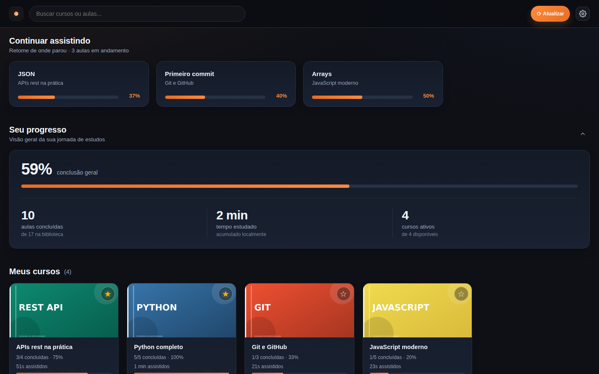
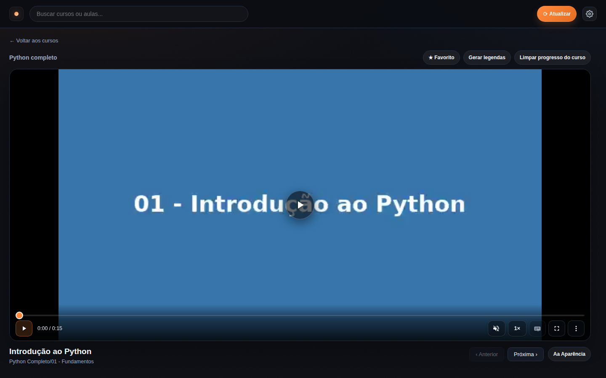
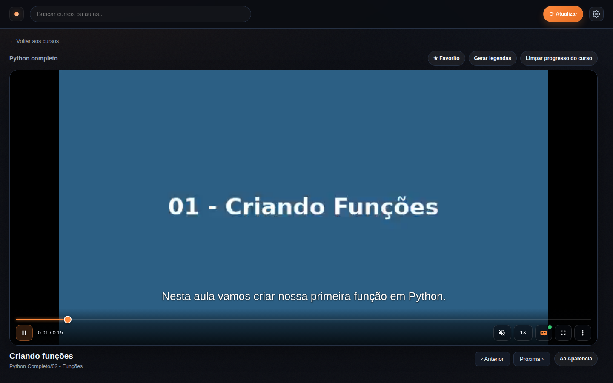
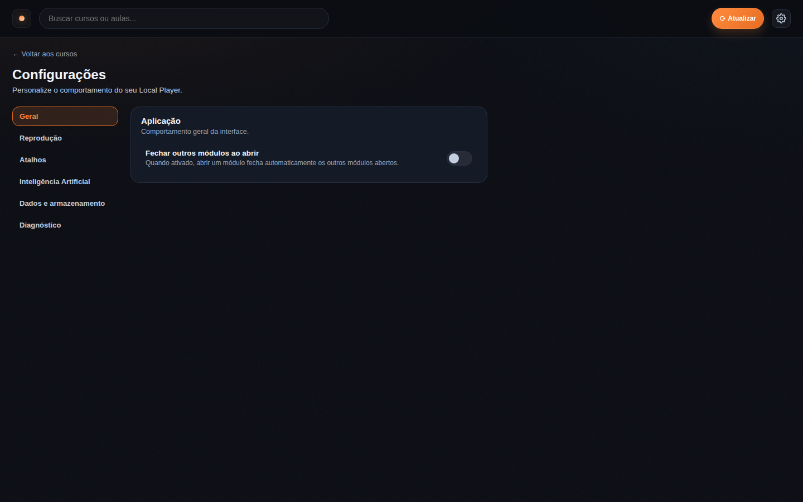

# Local Player (local)

O **Local Player** é uma aplicação local/offline (Node.js + Express com
frontend em HTML/CSS/JS puro) para organizar e reproduzir conteúdo de mídia
armazenado em disco — cursos, treinamentos, bibliotecas de vídeo, etc. Ele lê
tudo direto do disco (HD, SSD, pendrive), sem upload para a internet.

## Capturas de tela

<div align="center">
  
  
</div>

<div align="center">
  
  
</div>

> Capturas da aplicação em execução.

## Funcionalidades

- escaneia pastas de cursos e monta a árvore automaticamente;
- lista cursos em cards com capa automática por imagem da pasta;
- **tópicos hierárquicos**: pastas que apenas organizam outras pastas viram
  tópicos navegáveis (card → lista de filhos com breadcrumb `Home › TI › Python`,
  profundidade arbitrária). Só cursos abrem o player — veja abaixo;
- busca por tópico, curso, aula e material de apoio;
- player com progresso persistente por aula;
- sidebar com navegação por módulos/aulas e progresso do curso — a sidebar
  exibe **apenas módulos e aulas/vídeos**; arquivos de apoio (PDF, DOC/XLS/PPT,
  ZIP, imagens de material) ficam **exclusivamente** na seção **"Materiais da
  aula"** abaixo do player;
- atalhos de teclado configuráveis (veja abaixo);
- reprodução direta do arquivo original (sem conversão nem reprocessamento);
- fallback de transcoding para vídeos que o navegador não reproduz (veja abaixo);
- títulos padronizados automaticamente (veja abaixo);
- **bibliotecas externas configuráveis**: além da pasta ao lado do app, registre
  bibliotecas extras por path absoluto em Configurações → Bibliotecas — o app
  navega, busca, toca, transcodifica e gera legendas nelas sem copiar nada.

## Títulos padronizados

Cursos, módulos e aulas são exibidos com títulos limpos, como se tivessem sido
escritos para a plataforma — o nome original dos arquivos/pastas não é alterado.

- prefixos simbólicos removidos: `==`, `###`, `--`, `**`, `>`, `_`, `=`, emojis;
- numeração do início removida nas aulas (a interface não exibe números):
  `03 - Estruturas de dados` → `Estruturas de dados`;
- módulos/tópicos MANTÊM o número de exibição (`01 - Introdução à lógica de
  programação`) para você saber em qual está; o restante do título é
  normalizado normalmente;
- rótulos removidos quando sobra título (`Aula 03 - X` → `X`);
- sufixos de autoria removidos (` - By @canal`);
- truncamentos sem "..." (`Arq...` → `Arq`);
- capitalização de sentença em português (`FUNÇÕES LAMBDA` → `Funções lambda`),
  preservando siglas e nomes de tecnologia (SQL, Python, PostgreSQL, …);
- números que fazem parte do conteúdo são preservados (`3D Modelagem`, `4K`);
- títulos podem quebrar em até 2 linhas (CSS `line-clamp`) sem cortar com "...";
- o console do navegador (F12) avisa títulos que ainda não passaram nas regras,
  para correção manual.

## Tópicos hierárquicos (por marcador explícito)

A estrutura física de pastas é a fonte de verdade — não existe taxonomia
paralela nem configuração manual. Um tópico é declarado explicitamente, de
duas formas equivalentes:

- **Arquivo `.topic`** dentro da pasta (arquivo vazio; é dotfile, então nunca
  aparece na interface, na busca nem nas contagens).
- **Nome real terminando em `(TP)`** (case-insensitive, só no final):
  `1 Linguas (TP)/`, `TI(TP)/`, `Áudio (tp)/`. O `(TP)` é removido apenas do
  título de exibição, junto com a numeração inicial (`1. Language` → `Language`,
  primeira letra sempre maiúscula); o nome da pasta permanece intacto.

Tudo que **não** tem um desses marcadores segue o comportamento normal: é um
**curso** (pasta com vídeos/aulas/módulos — abre o player completo, com
progresso, favoritos, legendas e materiais) ou um módulo dentro de curso.
Nenhuma heurística de conteúdo (quantidade de arquivos, profundidade,
presença de vídeo, nomes de módulo) classifica uma pasta como tópico.

Exemplos:

```
1 Linguas (TP)/Inglês/…            → Linguas = TÓPICO, Inglês = curso
TI/.topic + TI/Curso Linux/aula    → TI = TÓPICO, Curso Linux = curso
Curso X/Módulo 1/Aula.mp4          → Curso X = curso (modular, sem marcador)
Curso Y/Aula.mp4                   → Curso Y = curso
Projeto TP/                        → curso normal (TP sem parênteses)
(TP) Curso/                        → curso normal (marcador fora do final)
```

Na Home, tópicos e cursos aparecem no mesmo grid; a busca encontra ambos (e
aulas/materiais dentro de cursos aninhados); "Continuar assistindo" e o
progresso continuam keyed por vídeo/curso, independente da profundidade.

**"Seu progresso" é contextual**: na Home ele só conta os **cursos diretos**
da raiz (e some quando a raiz não tem curso direto, ex.: biblioteca toda
organizada em tópicos); dentro de um tópico, considera somente os cursos da
subárvore daquele tópico (aninhados inclusive). **"Continuar assistindo" é
global somente na Home** (qualquer curso de qualquer tópico/biblioteca) e
vira local ao tópico quando você navega para dentro de um.

## Bibliotecas externas

Além da biblioteca padrão (a pasta ao lado do app), você pode registrar
**bibliotecas externas configuráveis** em **Configurações → Bibliotecas**:
cada uma tem nome, path absoluto e pode ser ativada/desativada. O path é
validado (absoluto, realpath, sem aninhamento com bibliotecas existentes, sem
apontar para a pasta do app/dados). A biblioteca padrão não pode ser removida
nem ter o path alterado.

- A **Home** mostra cursos/tópicos de todas as bibliotecas habilitadas;
  "Continuar assistindo" e o progresso funcionam por vídeo, em qualquer
  biblioteca.
- **Progresso, favoritos e caches** (transcode/legendas) são escopados por
  biblioteca — o mesmo arquivo relativo em bibliotecas distintas não colide.
- **Remover** uma biblioteca é **config-only**: nenhum arquivo é tocado e o
  progresso/cache permanecem (readicionar pelo mesmo path reusa tudo). A
  remoção é bloqueada enquanto houver jobs ativos (transcode/legenda) para ela.

## Requisitos

- Node.js 18+ (recomendado).
- Um navegador moderno (Chrome, Firefox, Edge).

## Plataformas suportadas

Linux **e** Windows — o mesmo código roda nos dois sistemas, sem scripts
separados nem versões distintas:

- a raiz da biblioteca é sempre a **pasta-pai da pasta do app** (`ROOT` derivado
  de `__dirname`), então funciona igual em `/home/user/Biblioteca`,
  `/run/media/user/HD/Biblioteca` ou `C:\Users\João\Meus Cursos`,
  `D:\Biblioteca`, `E:\Conteúdo\TI`;
- os caminhos são montados com as APIs de `path` do Node (`path.join` /
  `path.resolve`) — sem concatenação manual nem separador fixo;
- as chaves de progresso, os paths da árvore e as URLs usam sempre `/`
  (formato canônico), independente do separador do sistema;
- caminhos com espaços, acentos, parênteses e hífens funcionam nos dois
  sistemas (ex.: `D:\Biblioteca de Vídeos (SSD)\2026`);
- `npm install --no-bin-links` e `npm start` funcionam em Linux e Windows.

O servidor serve o arquivo original do disco e quem decodifica é o navegador —
formatos compatíveis tocam direto, sem conversão. **FFmpeg/FFprobe** são
opcionais: só entram no *fallback* de transcoding quando o navegador não
reproduz um formato (veja "Compatibilidade e transcoding de fallback").

## Como rodar

O app deve ficar em uma pasta cujo **pai seja a raiz da biblioteca**: o
servidor deriva a raiz do diretório que contém a pasta do app e escaneia o que
estiver ao lado dela. Exemplo de layout:

```text
Minha Biblioteca/
├── Curso A/
├── Curso B/
└── _LocalPlayer/          ← pasta do app (pode ter qualquer nome)
```

No terminal, dentro da pasta do app:

```bash
npm install --no-bin-links
npm start
```

Abra no navegador:

```text
http://localhost:4173
```

## Configuração

Variáveis de ambiente (todas opcionais):

- `PORT` — porta do servidor (padrão `4173`);
- `HOST` — interface de escuta (padrão: todas as interfaces). Use `HOST=127.0.0.1`
  para restringir à máquina local;
- `FFMPEG_BIN` / `FFPROBE_BIN` — caminho dos binários de ffmpeg/ffprobe (padrão:
  `ffmpeg`/`ffprobe` no PATH). Aceita caminho completo com espaços — no Windows,
  por exemplo `C:\ffmpeg\bin\ffmpeg.exe`;
- `MAX_CONCURRENT_TRANSCODES` — quantas conversões rodam em paralelo (padrão `1`);
- `MAX_CONCURRENT_TRANSCRIPTIONS` — quantas transcrições (whisper) rodam em
  paralelo (padrão `1`);
- `BACKGROUND_SUBTITLE_GENERATION` — `true`/`1` liga a geração de legendas em
  background (prioridade P3) para a biblioteca, após a fila prioritária (P0–P2)
  esvaziar. Sem a env, vale a config persistida na Central de IA.

Exemplos de definição de variáveis:

```bash
# Linux / macOS
FFMPEG_BIN=/usr/bin/ffmpeg npm start
```

```bat
rem Windows (cmd)
set FFMPEG_BIN=C:\ffmpeg\bin\ffmpeg.exe
npm start
```

```powershell
# Windows (PowerShell)
$env:FFMPEG_BIN = "C:\ffmpeg\bin\ffmpeg.exe"
npm start
```

## Como usar

1. Use a tela inicial para abrir um curso.
2. Na página do curso, navegue pela sidebar lateral para escolher a aula.
3. O progresso é salvo automaticamente e retomado depois.
4. Use **⟳ Atualizar** no topo quando mudar arquivos/pastas da biblioteca.
5. Use o ícone no canto esquerdo do header para voltar à Home.

## Atalhos de teclado

Os atalhos são **configuráveis** pela aba **Configurações**: clique em um atalho e
pressione a nova tecla para alterá-lo (o botão "Restaurar atalhos padrão" devolve
todos os valores iniciais). Se a tecla escolhida já estiver em uso por outra ação,
a troca é recusada com um aviso e o atalho anterior é mantido.

Padrões:

- `Espaço` reproduzir/pausar
- `←` / `→` volta/avança 5s
- `J` / `L` volta/avança 10s
- `N` próxima aula
- `P` aula anterior
- `M` mute/unmute
- `,` / `.` diminui/aumenta velocidade
- `F` alterna tela cheia
- `/` foca na busca
- `H` volta para Home

Os atalhos são reconhecidos pelo **caractere gerado** (`event.key`), não pela
posição física da tecla. Num teclado ABNT2 as teclas `,` `.` `/` ficam em
posições diferentes do americano — se algum atalho não fizer sentido no seu
layout, é só redefini-lo pela aba **Configurações**.

## Capas dos cursos

O sistema procura automaticamente imagens na pasta do curso.
Nomes priorizados: `cover`, `thumbnail`, `poster`, `banner`, `image`, `img`.

Exemplos válidos:

- `cover.jpg`
- `cover.png`
- `thumbnail.jpg`
- `banner.webp`

## Desempenho e compatibilidade de vídeo

O player reproduz o arquivo original direto do disco, como um player local
(VLC): sem transcodificação, sem cache gerado, sem troca de fonte.

- o streaming usa HTTP Range (resposta `206` com `Accept-Ranges: bytes`),
  então o navegador lê apenas os trechos que precisa (seek e buffering);
- se o navegador não suportar o formato/codec do arquivo, é acionado o
  fallback de transcoding descrito abaixo — o arquivo original nunca é alterado.

## Compatibilidade e transcoding de fallback

Vídeos que o navegador não reproduz (ex.: `.mkv`, codecs exóticos) são
convertidos para **MP4 / H.264 / AAC** com ffmpeg, **apenas quando necessário** —
nunca preventivamente. O fluxo:

1. o player tenta reproduzir o original imediatamente;
2. se funcionar, continua direto (sem tocar no ffmpeg);
3. se falhar, o servidor verifica o cache e, não havendo, inicia a conversão;
4. o resultado é servido **progressivamente**: o usuário começa a assistir em
   segundos, sem esperar a conversão inteira (a posição e o volume são mantidos).

- **Cache**: os arquivos convertidos ficam em `data/transcoded/` (nome
  determinístico por hash do caminho). O cache é reutilizado enquanto o arquivo
  original não mudar (comparação por mtime); se o original for alterado, é
  reconvertido. O `.tmp` só vira cache após a conversão concluir com sucesso —
  nunca se serve um arquivo parcial como se fosse o final.
- **Concorrência**: apenas **um** ffmpeg por vídeo (requisições simultâneas
  compartilham o mesmo job) e, por padrão, apenas **1** conversão por vez
  (fila; configure com `MAX_CONCURRENT_TRANSCODES`).
- **Seek**: após a conversão completa, o seek é total (HTTP Range). Durante a
  conversão, buscar para um trecho ainda não convertido aguarda ou mostra
  buffering até o ffmpeg alcançar — a reprodução sequencial é contínua.
- **Configuração**: `FFMPEG_BIN` / `FFPROBE_BIN` (padrão `ffmpeg`/`ffprobe` no
  PATH). Sem ffmpeg instalado, o player mostra uma mensagem clara em vez de
  travar.
- **Limpar cache**: em **Configurações**, o botão "Limpar cache de vídeos
  transcodificados" remove `data/transcoded/` (e cancela conversões em
  andamento) sem afetar o progresso.

## Progresso e dados locais

- progresso é salvo localmente em `data/progress.json`;
- a escrita é atômica e durável (fsync + rename): o progresso sobrevive a
  restart do servidor, desligamento brusco e desmontagem do pendrive;
- um backup do último estado válido é mantido em `data/progress.json.bak`;
  se o arquivo principal for corrompido, o progresso é restaurado
  automaticamente do backup (o arquivo danificado é preservado como
  `progress.json.corrupt-<timestamp>`);
- você pode limpar progresso do curso atual ou de toda a biblioteca pela interface.

## Legendas por IA (transcrição local + correção opcional por LLM)

O player gera **legendas automáticas** por vídeo usando um pipeline local:

`Vídeo → extração de áudio (ffmpeg) → ASR local (Whisper) → transcrição bruta →
pós-processamento determinístico → correção opcional por LLM → WebVTT → cache →
overlay customizado no player`

- Geração é um recurso **adicional** e nunca bloqueia a reprodução: sem
  binário/modelo/LLM/chave/internet, o player funciona normalmente (o badge
  mostra "Legenda indisponível").
- Quando a legenda está pronta, o player a exibe em um **overlay customizado**
  (`.subtitle-overlay`), posicionado sobre a área real do vídeo (letterbox
  incluso), com fonte dimensionada à altura do quadro e badge de status
  discreto ("Legenda disponível" / "Gerando legenda…" / "Legenda indisponível" /
  "Erro ao gerar").
- O **Whisper não acompanha o projeto**: instale o binário `whisper-cli*` em
  `bin/` e os modelos `ggml-*.bin` em `models/` (nenhum download automático).
  A detecção de status é **real** — sem binário/modelo, a interface mostra
  "Não instalado".
- A configuração fica em `data/ai-config.json` (escrita atômica, como o
  progresso). As chaves de API ficam **somente no servidor** — nunca no
  navegador e nunca nos logs.
- Providers de transcrição (ex.: Whisper, Moonshine) e de LLM
  (OpenAI-compatible: OmniRoute, OpenRouter, OpenAI, ...) são **registros
  data-driven** no `server.js`: adicionar um provider novo não muda o fluxo.
- A correção por LLM é **opcional** e protegida por um guardrail que rejeita
  saída com IDs faltando/duplicados/inventados ou conteúdo muito curto/longo —
  a transcrição original é sempre preservada em `data/subtitles/raw/`.
- Endpoints de estado/config: `GET /api/ai/status`, `GET/POST /api/ai/config`,
  `POST /api/ai/reset`, `POST /api/ai/llm/test`.
- Endpoints de legendas: `POST /api/subtitles/generate`, `GET /api/subtitles/status`,
  `GET /api/subtitles/list`, `GET /subtitles/<hash>.vtt`,
  `POST /api/subtitles/cancel`, `POST /api/subtitles/clear`,
  `GET /api/subtitles/editor`, `POST /api/subtitles/save`,
  `POST /api/subtitles/export`, `POST /api/subtitles/ai-corrections`.
- O botão **Testar conexão** envia apenas `Responda apenas: OK` ao endpoint
  `chat/completions` do provedor configurado (nunca conteúdo do curso), com
  timeout configurável.

### Editor de legendas (estilo YouTube)

> **Desativado**: o botão **"✎ Legendas"** foi removido do player e a rota
> `?editSubtitles=1` é ignorada — o editor não abre na interface. O restante
> desta seção documenta o comportamento caso a funcionalidade seja reativada.

Cada vídeo com legenda pode ser aberto num **editor** pelo botão **"✎ Legendas"**
no player (rota `#/course/...?lesson=...&editSubtitles=1`):

- **Lista de segmentos** com texto editável, tempos em `m:ss.mmm` ajustáveis por
  inputs, botões **"Definir início/fim"** (usa o instante atual do vídeo) e
  nudge **±0,5s/±1s**.
- **Adicionar após / dividir / mesclar / excluir** segmento; **click na linha**
  navega o vídeo; o segmento atual é destacado em tempo real (sem re-render da
  lista) com auto-scroll que pausa quando você rola.
- **Undo/redo** (pilha limitada de snapshots), **dirty guard** ao sair com
  alterações e **preview ao vivo** no overlay do player.
- **Salvar** grava um JSON estruturado em `data/subtitles/edited/` (ids de
  segmento estáveis + versão inteira) e regenera o WebVTT derivado — o espelho
  `data/subtitles/` e o canônico `ROOT/<curso>/.courseplayer/subtitles/`.
  A transcrição bruta nunca é tocada.
- **Duas abas editando a mesma legenda**: a versão salva por uma aba faz a outra
  receber o aviso "Esta legenda foi alterada em outra aba" (diálogo com
  "Recarregar editor") — nunca há sobrescrita silenciosa.
- **Exportar** o resultado como VTT ou SRT; **"Corrigir com IA"** reenvia só os
  textos dos segmentos ao LLM configurado e devolve sugestões para você revisar
  (nada é gravado automaticamente). **Regenerar** refaz a geração do zero,
  preservando um backup da sua edição antes.

## Configuração de transcrição local (Whisper)

O ASR é o **whisper.cpp** (binário `whisper-cli`), executado como processo local
pelo servidor. Nada é baixado automaticamente. Os comandos abaixo foram
**testados** nesta máquina (Ubuntu x86-64, whisper.cpp **1.9.2**, modelo
`ggml-small.bin`).

### 1. Binário + bibliotecas

1. Baixe o release do whisper.cpp para sua plataforma
   (`whisper-bin-ubuntu-x64.tar.gz`, etc.) de
   <https://github.com/ggml-org/whisper.cpp/releases>.
2. Extraia. O pacote traz o `whisper-cli` **e as bibliotecas irmãs**
   (`libggml*.so*`) — **mantenha tudo junto**: o binário carrega
   `libggml-cpu-*.so`/`libggml-base.so` pelo caminho do próprio executável.
3. Torne-o executável: `chmod +x whisper-cli`.

```bash
# exemplo (Linux x86-64) — extrai para ~/.local/opt/whisper.cpp/whisper-bin-ubuntu-x64/
tar -xzf whisper-bin-ubuntu-x64.tar.gz
```

### 2. Modelo

Baixe um modelo no formato GGML (`ggml-*.bin`) do mesmo repositório e coloque
em `models/` (ou onde apontar `WHISPER_MODEL_DIR`):

```bash
# ~465 MB — boa relação precisão/velocidade (RTF medido ≈0.38 nesta máquina)
# alternativas menores: ggml-base.bin, ggml-tiny.bin
wget https://huggingface.co/ggerganov/whisper.cpp/resolve/main/ggml-small.bin \
  -O models/ggml-small.bin
```

### 3. Aponte o servidor para o binário

O servidor procura `whisper-cli*` em `bin/` por padrão. Se estiver em outro
lugar, defina a env antes do `npm start`:

```bash
WHISPER_BIN=/caminho/para/whisper-cli npm start
```

> **Drives FAT/vfat (pendrive/exFAT) não executam binários.** Se o app está num
> pendrive, mantenha o `whisper-cli` (e seus `.so` irmãos) num filesystem com
> execução (ex.: `~/.local/opt/...`) e aponte `WHISPER_BIN` para lá. Os modelos
> (dados, não executáveis) podem ficar em `models/` no pendrive.

### 4. Validar

```bash
# 1. Status real da IA (binário + modelo detectados)
curl http://localhost:4173/api/ai/status

# 2. Geração sob demanda de um vídeo (aula aberta = P0)
curl -X POST "http://localhost:4173/api/subtitles/generate?priority=0&path=<rel-do-video>"

# 3. Legenda pronta no curso + espelho
#    ROOT/<curso>/.courseplayer/subtitles/<hash>.vtt  (canônico)
#    data/subtitles/<hash>.vtt                         (espelho)
```

### Limitações conhecidas (desta instalação)

- **VAD (pular silêncio) indisponível por padrão**: o whisper-cli **1.9.2
  rejeita a flag curta `-vad`** (sai com código 0 sem gerar saída) e o VAD real
  usa `-vm`/`--vad-model`, que exige o modelo `ggml-silero-vad.bin` (não
  instalado). Por isso a Central de IA mostra VAD como **não suportado** e o
  pipeline **não passa `-vad`** — transcrição normal funciona sem VAD.
- Threads: configurados via `-t N` (0 = automático).
- Progresso real: o pipeline usa `-pp` e parseia `progress = N%` do stderr
  (nunca porcentagem inventada).

> Guia passo a passo completo (com solução de problemas e desempenho medido):
> **`docs/whisper.md`**.

## Segurança

- Nenhum dado do curso é enviado para a internet: o servidor roda na sua
  máquina. As únicas requisições externas são (a) o **teste de conexão** de LLM
  — apenas quando você clica no botão, mensagem mínima "Responda apenas: OK" —
  e (b) a **correção por LLM** de legendas, se você habilitar a correção e
  configurar um provedor com chave. Em ambos, a chave fica só no servidor e o
  guardrail impede que a legenda seja corrompida por saída inválida.
- Caminhos vindos do navegador são validados contra *path traversal*: o
  servidor só serve arquivos dentro da raiz da biblioteca.
- A pasta do app (`_LocalPlayer/`, incluindo `data/` — progresso e chaves de IA)
  **não** é servida por `/media/*`: o scan a exclui e o serviço de arquivos
  devolve 404 para `/media/<APP_DIR_NAME>/*` (case-exato no Linux,
  case-insensitive no Windows).
- Os nomes dos caches de transcoding e de legendas são hashes (nunca nomes de
  arquivo do usuário em URLs).
- O servidor escuta em todas as interfaces de rede por padrão
  (`app.listen(PORT)`). Em uma rede local, outros dispositivos da mesma rede
  conseguem abrir a interface. Para restringir à máquina local, defina
  `HOST=127.0.0.1`.

## Desenvolvimento

- Sem build step e sem framework: edite `server.js` e `public/` e recarregue a
  página.
- Verificação rápida de sintaxe: `node --check server.js public/app.js`.
- Testes: `node --test test/topics.test.js test/libraries.test.js` (regra de
  tópicos por marcador + bibliotecas externas).
- Valide mudanças rodando o servidor e exercitando a interface.

## Estrutura

- `server.js`: scan de biblioteca, API e streaming dos arquivos originais;
- `public/index.html`: estrutura base;
- `public/styles.css`: estilo da interface;
- `public/app.js`: lógica de UI, roteamento e player;
- `data/`: progresso, cache de transcoding, configuração de IA e registro de
  bibliotecas (`libraries.json`) locais;
- `test/topics.test.js`: testes da regra de tópicos por marcador (`node:test`);
- `test/libraries.test.js`: testes das bibliotecas externas (`node:test`);

## Documentação completa

Para o manual técnico completo (arquitetura, API, fluxos, como alterar e
manter o projeto), veja [docs/DOCUMENTACAO.md](docs/DOCUMENTACAO.md).

Para instalar e configurar a transcrição local (Whisper), veja
[docs/whisper.md](docs/whisper.md).

Para o relatório da navegação hierárquica por tópicos (marcadores `.topic` e
`(TP)`, alterações, compatibilidade, migração, riscos), veja
[docs/TOPICOS-MARCADORES.md](docs/TOPICOS-MARCADORES.md).

Para o relatório das bibliotecas externas configuráveis (registry, validação,
API, escopo de progresso/caches, remoção config-only), veja
[docs/BIBLIOTECAS.md](docs/BIBLIOTECAS.md).

## Observações

- funciona em **Linux** e **Windows**; o app pode ser copiado para qualquer
  pasta, HD externo ou pendrive — a biblioteca padrão é sempre a pasta ao lado
  do app, e bibliotecas externas podem ser adicionadas por path absoluto
  (Configurações → Bibliotecas);
- `npm install --no-bin-links` ajuda em alguns cenários com pendrive/HD externo
  (funciona nos dois sistemas);
- se houver demora no início do vídeo, confira o desempenho do disco (a leitura
  é feita direto do armazenamento).
