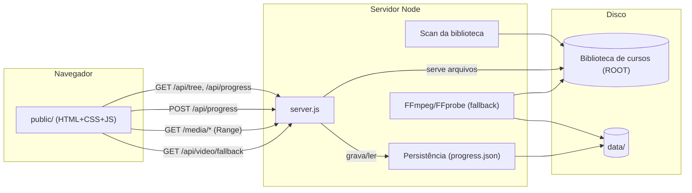
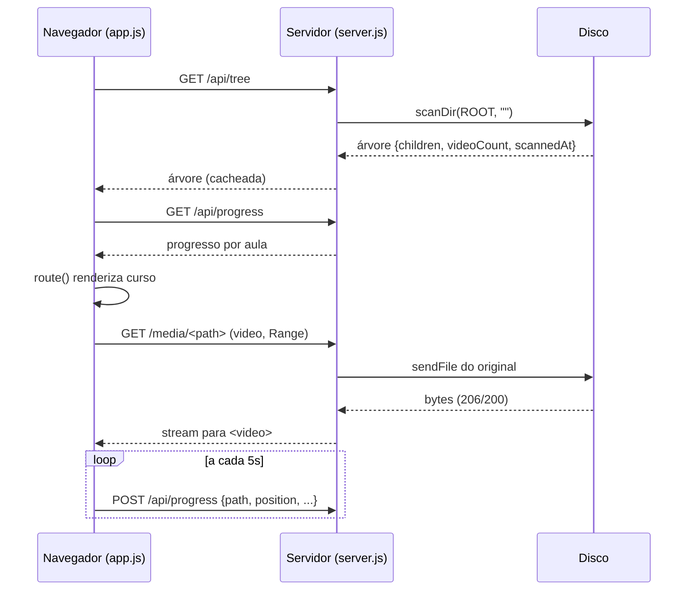
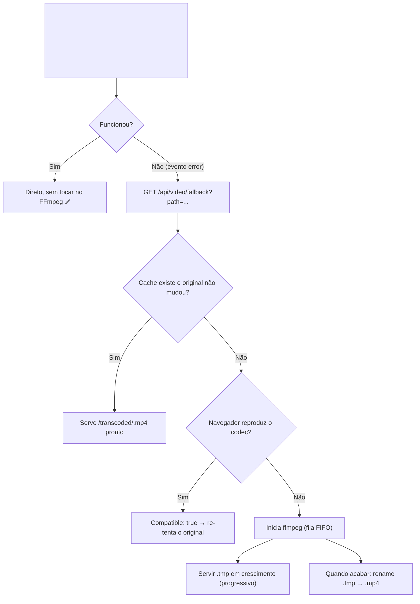

# Local Player — Documentação Técnica

> Manual completo e didático do **Local Player**, um player local/offline de
> conteúdo de mídia — cursos, treinamentos, bibliotecas de vídeo, etc. Esta
> documentação foi escrita **a partir do código real do projeto** (fonte de
> verdade): `server.js`, `public/`, `package.json`
> e `.gitignore`. Nada aqui é inventado — cada afirmação corresponde a uma
> implementação que você pode abrir e conferir.
>
> **Público:** estudante de TI júnior. Cada seção segue o formato
> *O que é? → Por que existe? → Como funciona neste projeto? → Onde está
> implementado?*

---

## Sumário

**Parte I — Visão geral**
1. [Visão geral do projeto](#1-visão-geral-do-projeto)
2. [Tecnologias utilizadas](#2-tecnologias-utilizadas)
3. [Estrutura de diretórios](#3-estrutura-de-diretórios)
4. [Arquitetura geral (diagramas)](#4-arquitetura-geral-diagramas)

**Parte II — Backend (`server.js`)**
5. [Backend por responsabilidades](#5-backend-por-responsabilidades)
6. [Raiz da biblioteca (ROOT)](#6-raiz-da-biblioteca-root)
7. [O scanner de cursos](#7-o-scanner-de-cursos)
8. [Seleção de capas](#8-seleção-de-capas)
9. [Segurança de caminhos (path traversal)](#9-segurança-de-caminhos-path-traversal)
10. [API completa](#10-api-completa)
11. [Persistência de progresso](#11-persistência-de-progresso)
12. [Transcoding de fallback (servidor)](#12-transcoding-de-fallback-servidor)

**Parte III — Frontend (`public/`)**
13. [Frontend — visão geral](#13-frontend--visão-geral)
14. [Estado global (`state`)](#14-estado-global-state)
15. [Roteamento por hash](#15-roteamento-por-hash)
16. [Progresso e tracking do player](#16-progresso-e-tracking-do-player)
17. ["Continuar assistindo"](#17-continuar-assistindo)
18. [Busca](#18-busca)
19. [Player e controles](#19-player-e-controles)
20. [Áudio e volume (GainNode)](#20-áudio-e-volume-gainnode)
21. [Atalhos de teclado configuráveis](#21-atalhos-de-teclado-configuráveis)
22. [Cache de transcoding (frontend)](#22-cache-de-transcoding-frontend)
23. [Configurações](#23-configurações)

**Parte IV — Uso**
24. [Instalação e execução](#24-instalação-e-execução)
25. [Primeiro uso](#25-primeiro-uso)
26. [Fluxos completos](#26-fluxos-completos)
27. [Como alterar o projeto](#27-como-alterar-o-projeto)

**Parte V — Manutenção**
28. [Como investigar bugs](#28-como-investigar-bugs)
29. [Erros comuns](#29-erros-comuns)
30. [Decisões arquiteturais](#30-decisões-arquiteturais)
31. [Limitações conhecidas](#31-limitações-conhecidas)
32. [Glossário](#32-glossário)
33. [Mapa mental](#33-mapa-mental)
34. [Guia rápido para um novo dev](#34-guia-rápido-para-um-novo-dev)
35. [Manutenção desta documentação](#35-manutenção-desta-documentação)

---

# Parte I — Visão geral

## 1. Visão geral do projeto

**O que é?**

O **Local Player** é um player local/offline de conteúdo de mídia que roda no
seu computador e lê o conteúdo **direto do disco** (HD, SSD, pendrive). Ele
escaneia as pastas e monta uma árvore do conteúdo — que pode representar
cursos → módulos → aulas, treinamentos, bibliotecas de vídeo etc. — e permite:

- assistir vídeos no navegador com **progresso salvo por aula**;
- buscar por curso, aula e material de apoio;
- marcar cursos como favoritos;
- controlar tudo por **atalhos de teclado**;
- reproduzir o **arquivo original** do disco, sem upload para a internet.

**Por que existe?**

Plataformas de curso online (Hotmart, etc.) ficam indisponíveis quando o
internet cai, o servidor cai ou a sua assinatura expira. Quem comprou cursos e
os baixou para um HD externo perde o conforto de navegar por eles. O Local
Player resolve isso: é um *player local*, que funciona offline, como um VLC,
mas com organização de biblioteca e tracking de progresso.

**Como funciona neste projeto?**

A aplicação tem duas metades:

1. **Backend** (`server.js`) — um servidor HTTP Node.js que escaneia o disco,
   expõe uma API JSON e serve os vídeos com suporte a *Range requests* (o que
   permite *seek* e buffering no navegador).
2. **Frontend** (`public/`) — uma Single Page Application (SPA) em
   HTML/CSS/JS puro que conversa com essa API e renderiza a interface.

Tudo roda localmente em `http://localhost:4173`. Nenhum dado sai da sua
máquina.

**Onde está implementado?**

| Arquivo | Papel |
| --- | --- |
| `server.js` | Todo o backend: scan, API, media, persistência, transcoding |
| `public/index.html` | Casca da SPA (barra superior + `<main id="app">`) |
| `public/app.js` | Toda a lógica de UI, roteamento, player e atalhos |
| `public/styles.css` | Estilos (tema escuro, layout, gradientes de capa) |
| `package.json` | Metadados e dependência única (Express) |
| `data/` | Dados de runtime: `progress.json`, `transcoded/` etc. |

---

## 2. Tecnologias utilizadas

**O que é?**

As tecnologias são as ferramentas usadas para construir o projeto.

**Por que existe?**

Cada tecnologia foi escolhida para um objetivo claro: **simplicidade** e
**portabilidade** (rodar em qualquer drive, sem internet, sem build).

**Como funciona neste projeto?**

| Tecnologia | Versão | Para que serve aqui |
| --- | --- | --- |
| **Node.js** | 18+ (recomendado) | Runtime JavaScript do servidor |
| **Express** | `^4.19.2` (instalado 4.22.2) | Framework HTTP: rotas da API, `sendFile`, `express.static` |
| **HTML / CSS / JS puro** | — | Frontend SPA, **sem framework e sem build step** |
| **FFmpeg / FFprobe** | binários do sistema | *Fallback* de transcoding de vídeos incompatíveis |

Detalhes importantes:

- **Dependência real única: Express.** O `package.json` declara só ela.
  `npm install --no-bin-links` ajuda em pendrives/HDs com FAT/exFAT.
- **Sem build step.** O que está em `public/` é servido como está — não existe
  etapa de transpilação (TypeScript, Babel, bundler). Abra e edite os arquivos.
- **FFmpeg/FFprobe não são dependências npm** — são binários do sistema.
  Se não estiverem instalados, só o *fallback* de compatibilidade deixa de
  funcionar (com mensagem clara), o resto continua ok.

**Onde está implementado?**

- `package.json` — declara `express` e o script `npm start` → `node server.js`.
- `server.js` (linha 1) — `require("express")`, `require("fs/promises")`,
  `require("path")`, `require("crypto")`, `require("child_process")`.

---

## 3. Estrutura de diretórios

**O que é?**

A organização de pastas e arquivos do projeto.

**Por que existe?**

Entender onde cada coisa mora é o primeiro passo para mexer no código com
segurança.

**Como funciona neste projeto?**

```
"Biblioteca/"                   ← ROOT (raiz da BIBLIOTECA, fora do app)
├── Curso A/
│   ├── cover.jpg               ← capa (excluída dos materiais e da busca)
│   ├── Modulo 1/
│   │   ├── Aula 01 - intro.mp4
│   │   └── material.pdf
│   └── Modulo 2/
│       └── ...
├── Curso B/
│   └── ...
└── _LocalPlayer/               ← o APP (raiz do código)
    ├── server.js               ← backend completo
    ├── package.json
    ├── README.md               ← ponto de entrada rápido
    ├── public/
    │   ├── index.html          ← casca da SPA
    │   ├── app.js              ← UI/roteamento/player
    │   └── styles.css          ← estilos
    ├── data/                   ← dados de RUNTIME (não versione)
    │   ├── progress.json       ← progresso das aulas
    │   ├── progress.json.bak   ← backup automático
    │   ├── progress.json.corrupt-<ts> ← preservado se corromper
    │   ├── *.tmp               ← órfãos auto-limpados no boot
    │   └── transcoded/         ← cache de vídeos convertidos
    └── docs/
        └── DOCUMENTACAO.md     ← este arquivo
```

**Pontos que merecem atenção:**

- A pasta do app é `_LocalPlayer` — o pai dela é a biblioteca.
  Isso é o que permite copiar o app para qualquer drive: a raiz da biblioteca
  é **derivada** da localização do app, nunca hardcoded.
- `data/` contém **artefatos manuais** de sessões anteriores (por exemplo
  `progress.json.wiped-1701.bak`, `data/server.log`). O servidor **não** gera
  log em arquivo (só stdout) nem cria esses backups históricos — não dependa
  deles.

**Onde está implementado?**

- `.gitignore` — `node_modules/`, `data/` (runtime completo: progresso,
  backups, logs e cache de transcode), `*.tmp`/`*.temp`, `*.log`, `.env*`,
  arquivos de sistema e configs locais de editor (`.claude/settings.local.json`,
  `.vscode/`, `.idea/`).
- `server.js` — `ROOT`, `APP_DIR_NAME`, `DATA_DIR`, `PROGRESS_FILE`, etc.

---

## 4. Arquitetura geral (diagramas)

**O que é?**

A "foto grande" de como as peças se comunicam.

**Por que existe?**

Um diagrama ajuda a visualizar o fluxo antes de mergulhar no código.

**Como funciona neste projeto?**

### 4.1 Visão macro



### 4.2 Fluxo do scan → navegação → player



### 4.3 Fallback de transcoding (só quando necessário)



**Onde está implementado?**

- `server.js` — `getTree`, `scanDir`, rotas da API, transcoding.
- `public/app.js` — `route()`, `renderCourse`, `setupVideoTracking`,
  `prepareTranscoded`.

---

# Parte II — Backend (`server.js`)

## 5. Backend por responsabilidades

**O que é?**

O backend não é um "blob" único — ele tem **responsabilidades bem
delimitadas**, cada uma com suas funções.

**Por que existe?**

Separar responsabilidades deixa o código testável, legível e evita que uma
mudança em um lugar quebre outro.

**Como funciona neste projeto?**

O `server.js` (~1377 linhas) se organiza assim:

| Responsabilidade | Funções principais | Linha inicial aprox. |
| --- | --- | --- |
| Configuração e constantes | `ROOT`, `PORT`, `VIDEO_EXT`, `IGNORED_EXT` | 12 |
| Ordenação natural | `naturalSort` | 31 |
| Normalização de títulos | `normalizeDisplayTitle`, `removeLeadingNumbering`, `toDisplayCase`, `captureModuleNumber` | 68 |
| Seleção de capas | `pickCoverImage`, `chooseCoverImage` | 344 |
| Scan da biblioteca | `scanDir`, `getTree` (com cache `treeCache`) | 379 |
| Segurança de caminho | `resolveSafeRelPath` | 486 |
| Persistência | `readJsonFile`, `readProgress`, `writeFileAtomic`, `updateProgress`, `initPersistence` | 496 |
| Detecção de ferramentas | `detectTool`, `ensureTools` | ~630 |
| Transcoding | `transcodeCacheName`, `probeMedia`, `isBrowserCompatibleVideo`, `startTranscodeJob`, `scheduleNextTranscode`, `runTranscode` | 660–920 |
| Plano de fallback | `getTranscodePlan` | 935 |
| Streaming de arquivo em crescimento | `parseByteRange`, `serveGrowingFile`, `streamGrowingFile` | 984 |
| Rotas HTTP | `app.get("/api/tree")`, `app.post(...)`, `/media/*`, `/transcoded/*` | 1175 |
| Boot | `ensureTools`, `initPersistence`, `app.listen`, tratamento de `EADDRINUSE` | 1358 |

**Onde está implementado?**

Todo em `server.js`. O código é dividido com comentários `// ---` que marcam
as seções — siga esse padrão ao editar.

---

## 6. Raiz da biblioteca (ROOT)

**O que é?**

`ROOT` é o diretório que contém **todas as pastas de curso**. É a "biblioteca"
que o app escaneia.

**Por que existe?**

O app precisa saber onde procurar os cursos. Mas a raiz **não pode ser
hardcoded** — o app é feito para ser copiado para qualquer pendrive/HD, e a
biblioteca é o que estiver ao lado dele.

**Como funciona neste projeto?**

```js
// server.js (linha 13)
const ROOT = path.resolve(__dirname, ".."); // pasta-pai do app (raiz da biblioteca)
const APP_DIR_NAME = path.basename(__dirname); // "_LocalPlayer" - ignorado no scan
```

- `__dirname` é o caminho absoluto da pasta do **código** (o app).
- `path.resolve(__dirname, "..")` sobe um nível → a pasta **pai**, que contém
  os cursos. Funciona igual em Linux e Windows, ex.:
  - `/Biblioteca/_LocalPlayer` → `ROOT = /Biblioteca`;
  - `D:\Biblioteca\_LocalPlayer` → `ROOT = D:\Biblioteca`.
- `APP_DIR_NAME` guarda o nome da pasta do app (`_LocalPlayer`), que será
  ignorado no scan para o app não virar um "curso".

Regras de exclusão no scan (dentro de `scanDir`):

- entradas que começam com `.` (arquivos ocultos);
- a pasta do próprio app (`_LocalPlayer`), só quando `relDir === ""` (na
  raiz);
- arquivos com extensões ignoradas: `IGNORED_EXT = .ini, .db, .lnk`.

**Onde está implementado?**

- `server.js` linhas 13–18 (constantes) e 380–472 (`scanDir`).
- **Invariante:** nunca mude a base de `ROOT`. Se o app for movido de pasta,
  a biblioteca deve estar no nível acima.

---

## 7. O scanner de cursos

**O que é?**

O scanner percorre a árvore de pastas do disco e monta uma representação em
memória (a "árvore de conteúdo") com nós de três tipos: `folder` (pasta),
`video` (arquivo de vídeo) e `file` (material não-vídeo).

**Por que existe?**

O navegador não consegue listar pastas do disco. O servidor transforma o
sistema de arquivos em JSON que o frontend consome.

**Como funciona neste projeto?**

### Tipos de nó (exatamente o que o servidor envia)

```js
// Pasta (curso, módulo ou submódulo)
{ type: "folder", name, path, title, children, videoCount, coverImage }

// Vídeo (aula)
{ type: "video",  name, path, ext, size, title }

// Material (não-vídeo)
{ type: "file",   name, path, ext, size }
```

Exemplo real de path (chave de progresso também usa esse formato):

```
Aprendendo Python/01 - Introdução à Lógica de Programação/01 Apresentação do curso/01 -01 Boas-vindas.mp4
```

### Algoritmo (`scanDir`)

```js
async function scanDir(absDir, relDir) {
  // 1. lê a pasta com withFileTypes (sabe se é dir ou arquivo)
  const entries = await fs.readdir(absDir, { withFileTypes: true });
  // 2. separa em dirs e files, pulando ocultos e a pasta do app
  // 3. ordena com naturalSort (localeCompare pt-BR, numérico, case-insensitive)
  // 4. para cada pasta: recursão (sub = await scanDir(...)) → nó folder
  // 5. para cada arquivo: ignora IGNORED_EXT e a capa → nó video ou file
  // 6. escolhe a capa (veja seção 8)
  // 7. retorna { children, videoCount, coverImage }
}
```

### Cache (`getTree`)

```js
async function getTree(force) {
  if (!treeCache || force) {
    const result = await scanDir(ROOT, "");
    treeCache = { children: result.children, videoCount: result.videoCount, /* scannedAt */ };
  }
  return treeCache;
}
```

O scan **não roda a cada requisição**: o resultado fica cacheado em
`treeCache`. Para forçar novo scan: `GET /api/tree?rescan=1` ou
`POST /api/rescan`.

### Extensões

- `VIDEO_EXT`: `.mp4 .mkv .webm .mov .avi .m4v .wmv`
- `IMAGE_EXT`: usadas para capas
- `IGNORED_EXT`: `.ini .db .lnk`

### Ordenação natural

`naturalSort(a, b)` usa `a.localeCompare(b, "pt-BR", { numeric: true,
sensitivity: "base" })` — assim "Aula 2" vem antes de "Aula 10", e diferenças
de maiúscula/minúscula e acento não atrapalham.

**Onde está implementado?**

- `scanDir` (server.js linha 379), `getTree` (linha 473), `naturalSort`
  (linha 31), `normalizeDisplayTitle` (linha 68).
- Título de exibição é calculado **no servidor** — veja a seção
  [Normalização de títulos](#35-manutenção-desta-documentação) no final do
  capítulo de referência, ou o `README.md`.

> ⚠️ **Invariante:** a ordenação e a indexação de busca usam o **nome original**
> (`name`); o `title` normalizado é só exibição. Nunca altere `name`.

---

## 8. Seleção de capas

**O que é?**

Cada curso (pasta) pode ter uma **imagem de capa** que aparece no card da Home.

**Por que existe?**

Nem toda biblioteca tem capas nomeadas igual. O sistema procura **por nome**
(prioridades) para encontrar a melhor imagem possível automaticamente.

**Como funciona neste projeto?**

1. `pickCoverImage(files, relDir)` — procura na própria pasta imagens cujo
   nome contenha uma das dicas: `cover`, `thumbnail`, `poster`, `banner`,
   `image`, `img`. A primeira encontrada (por ordem natural) vira a capa
   direta — **pontuação 200**.
2. `chooseCoverImage(directCover, childCoverCandidates)` — se a pasta não tem
   imagem própria, pode **herdar a capa de uma pasta filha** (ex.: o módulo
   tem `cover.jpg` e o curso não) — **pontuação 50**.
3. Se nada for encontrado, `coverImage` é `null`, e o **frontend** renderiza
   um gradiente determinístico (baseado em `courseColor(name)`) com as
   iniciais do curso.

**Detalhe importante:** a imagem de capa é **excluída dos materiais e da
busca** (não aparece como "arquivo da aula"). Veja em `scanDir`:

```js
// A imagem de capa/banner é usada como thumbnail do card, não deve
// aparecer como material na sidebar nem nos resultados de busca.
if (entryRel === directCover) continue;
```

**Onde está implementado?**

- `pickCoverImage` (server.js linha 344), `chooseCoverImage` (linha 361),
  `COVER_NAME_HINTS` (cabeçalho).
- Frontend: `courseColor()` e `initials()` em `public/app.js`.

---

## 9. Segurança de caminhos (path traversal)

**O que é?**

**Path traversal** (ou *directory traversal*) é uma vulnerabilidade onde um
atacante manipula o caminho de um arquivo para **ler arquivos fora da pasta
permitida**. Exemplo clássico:

```
GET /media/../../etc/passwd
```

Se o servidor juntar esse caminho à raiz sem validação, ele poderia entregar
`/etc/passwd` — um arquivo sensível que não deveria ser exposto.

**Por que precisamos nos defender?**

O Local Player roda local, mas ainda aceita caminhos vindos do navegador em
vários endpoints (`/media/*`, `/api/video/fallback`, `/api/progress`,
`/api/progress/clear`). Qualquer página maliciosa que seu navegador abra pode
fazer requisições ao `localhost` (CSRF). Se o servidor servisse caminhos
arbitrários, um site malicioso poderia ler arquivos do seu disco. **A defesa é
obrigatória.**

**Como funciona neste projeto? (a defesa)**

Toda entrada de caminho do cliente passa por **uma única função**:

```js
function resolveSafeRelPath(relPath) {
  if (typeof relPath !== "string" || !relPath) return null;
  const normalized = path.normalize(relPath).replace(/^([/\\])+/, "");
  const abs = path.resolve(ROOT, normalized);
  if (abs !== ROOT && !abs.startsWith(ROOT + path.sep)) return null;
  // `rel` é SEMPRE canônico com "/" — mesmo formato da árvore do scan e das
  // URLs (multiplataforma). No Windows, `path.normalize` devolveria "\" e as
  // chaves de progresso deixariam de bater com os paths vindos do scan. O
  // `abs` mantém o separador nativo porque é o que o filesystem consome.
  return { abs, rel: normalized.split(path.sep).join("/") };
}
```

Ela faz três coisas:

1. **Normaliza** o caminho: `path.normalize("a/../b")` → `b`. Isso resolve as
   `..` e também remove redundâncias. Também remove barras iniciais
   (`/etc/passwd` → `etc/passwd`).
2. **Resolve** para absoluto: `path.resolve(ROOT, normalized)` junta com a raiz.
3. **Valida o resultado**: se `abs` não for exatamente `ROOT` nem começar com
   `ROOT + path.sep` → retorna `null` (inválido). Ou seja, **só são aceitos
   caminhos dentro de ROOT**.

O caminho `..` nunca chega ao `fs`: ou o `..` foi consumido dentro de ROOT
(ex.: `Modulo/../Modulo` → `Modulo`, ainda dentro), ou o resultado escapa e é
rejeitado.

**Windows (mesma defesa vale):** `path.normalize`/`path.resolve`/`path.sep` são
conscientes da plataforma:

- `..\..\arquivo` é detectado no Windows (o `\` é o separador nativo lá);
- caminhos absolutos `C:\Windows\...`, `D:\...` e UNC `\\server\share` são
  rejeitados: `path.resolve` os mantém absolutos e eles não começam com `ROOT`;
- `C:/Windows/...` (barra invertida) também é absoluto no Windows e é rejeitado;
- no Linux, `..\..\arquivo` não é "subir de pasta" (`\` é um caractere válido de
  nome), então vira um nome literal dentro de `ROOT` — inofensivo (não existe).

O `rel` devolvido é sempre canônico com `/` (item acima): no Windows
`path.normalize` produziria `\`, e sem essa normalização as chaves de progresso
deixariam de bater com os paths da árvore do scan.

**Como os endpoints usam:**

- `/media/*`: `resolveSafeRelPath` → se `null`, responde **404** (não vaza
  informação).
- `/api/video/fallback`: se `null`, responde **400**.
- `/api/progress` e `/api/progress/clear`: se `null`, responde **400**.
- `/transcoded/*`: não recebe caminho do usuário — o nome é validado por uma
  **regex estrita** `^([0-9a-f]{24})\.mp4$` (24 hex + `.mp4`). Um nome que não
  bata cai no `next()`. Assim, nunca é um caminho arbitrário.

**Onde está implementado?**

- `resolveSafeRelPath` (server.js linha 487).
- Aplicada em: `/media/*` (1301), `/api/video/fallback` (1252),
  `/api/progress` (1197), `/api/progress/clear` (1220).
- Regex estrita em `/transcoded/*` (linha 1328).

> ⚠️ **Regra para quem for mexer:** **todo** endpoint novo que aceite um path
> do cliente deve passar por `resolveSafeRelPath()`. É um invariante do
> projeto.

---

## 10. API completa

**O que é?**

O conjunto de rotas HTTP que o frontend usa para conversar com o servidor.

**Por que existe?**

A API é o contrato entre as duas metades do app. Conhecê-la é essencial para
entender o frontend e para adicionar recursos.

**Como funciona neste projeto?**

### Tabela de rotas

| Método | Rota | Propósito | Resposta |
| --- | --- | --- | --- |
| `GET` | `/api/tree?rescan=1` | Árvore de cursos (cacheada; `rescan=1` força novo scan) | `{children, videoCount, scannedAt}` |
| `POST` | `/api/rescan` | Força novo scan e retorna a árvore | idem |
| `GET` | `/api/progress` | Todo o progresso salvo | `{ "<path da aula>": {position, duration, completed, updatedAt} }` |
| `POST` | `/api/progress` | Salva progresso de uma aula | `{ok: true}` ou 400/500 |
| `POST` | `/api/progress/clear` | Limpa progresso de um curso (`coursePath`) ou de tudo (body vazio) | `{ok: true}` |
| `GET` | `/media/*` | Serve o **original** (vídeo via `sendFile`, material via `express.static`) | bytes, com Range (206) |
| `GET` | `/api/video/fallback?path=<rel>` | Plano de reprodução (compatível / transcode pronto / transcodificando) | JSON (ver abaixo) |
| `GET` | `/transcoded/<24-hex>.mp4` | Serve o cache de transcode (final ou `.tmp` em crescimento) | bytes, com Range |
| `POST` | `/api/transcode/clear` | Apaga `data/transcoded/` e cancela jobs | `{ok: true}` |

### Detalhes das rotas principais

**`POST /api/progress`** — corpo JSON `{path, position, duration, completed}`:

```js
app.post("/api/progress", async (req, res) => {
  const { path: relPath, position, duration, completed } = req.body || {};
  const safe = resolveSafeRelPath(relPath);
  if (!safe) return res.status(400).json({ error: "invalid path" });
  if (typeof position !== "number" || typeof duration !== "number") {
    return res.status(400).json({ error: "invalid position/duration" });
  }
  await updateProgress((progress) => {
    progress[safe.rel] = {
      position: Math.max(0, position),
      duration: Math.max(0, duration),
      completed: !!completed,
      updatedAt: Date.now(),
    };
  });
  res.json({ ok: true });
});
```

Note a validação em camadas: **path seguro** → **tipos numéricos** → **clamp**
(`Math.max(0, ...)`).

**`POST /api/progress/clear`** — remove por prefixo de chave do curso
(`<coursePath>/`). Assim, ao limpar um curso, todas as aulas aninhadas são
removidas de uma vez. Com corpo vazio, limpa tudo.

**`GET /api/video/fallback`** — respostas possíveis:

```jsonc
// Navegador reproduz o original (nada a fazer):
{ "compatible": true, "url": "/media/<path>" }

// Cache pronto:
{ "compatible": false, "status": "ready", "url": "/transcoded/<hash>.mp4" }

// Transcodificando agora (serve .tmp em crescimento):
{ "compatible": false, "status": "transcoding", "url": "/transcoded/<hash>.mp4" }

// Erro (arquivo não existe, ffmpeg ausente, falha):
{ "error": true, "message": "..." }
```

**`GET /media/*`** — o caminho feliz, sem tocar no FFmpeg:

```js
app.get("/media/*", async (req, res, next) => {
  let mediaRelPath = req.path.replace(/^\/media\/?/, "");
  try { mediaRelPath = decodeURIComponent(mediaRelPath); }
  catch { return res.status(400).end(); }

  const safe = resolveSafeRelPath(mediaRelPath);
  if (!safe) return res.status(404).end();

  const ext = path.extname(safe.abs).toLowerCase();
  if (!VIDEO_EXT.has(ext)) return next();       // material → express.static

  return res.sendFile(safe.abs, (err) => {
    if (err && err.code !== "ECONNRESET") next(err);
  });
});
```

Depois do `/media/*`, um `express.static(ROOT, {...})` em `/media` cuida dos
materiais não-vídeo.

**Guard de `APP_DIR_NAME`** (correção BUG-001): como a pasta do app fica
dentro de `ROOT`, um middleware em `/media` (antes da rota de vídeo e do
static) devolve **404** para qualquer caminho cujo primeiro segmento canônico
seja a pasta do app (case-exato no Linux, case-insensitive no Windows). Só o
nome exato é bloqueado — cursos com nomes parecidos continuam acessíveis.

**`GET /transcoded/*`** — valida o nome com a regex estrita; se há um job
ativo, entrega o `.tmp` em crescimento (`serveGrowingFile`); senão, se o
final existe, `sendFile`; `.tmp` órfão sem job → **404**.

**Onde está implementado?**

- Rotas: `server.js` linhas 1175–1347.
- Ordem importa: `express.json` primeiro; `/media/*`; `express.static` de
  `/media`; `/transcoded/*`; por último `express.static(public)` (a SPA).
  Cada rota `next()` deixa a requisição cair no handler seguinte.

---

## 11. Persistência de progresso

**O que é?**

Como o app guarda "em qual segundo da aula você parou", se concluiu, quanto
assistiu — e como garante que isso **não se perde** mesmo com queda de energia.

**Por que existe?**

O progresso é o principal valor do app. Perdê-lo ao desmontar um pendrive no
meio da escrita seria inaceitável. Por isso a persistência é projetada em três
camadas: **escrita atômica**, **fila serializada** e **backup com
auto-recuperação**.

**Como funciona neste projeto?**

### Formato dos dados

Arquivo `data/progress.json`, chaveado pelo **path relativo da aula**:

```json
{
  "Aprendendo Python/01 - Introdução à Lógica de Programação/01 Apresentação do curso/01 -01 Boas-vindas.mp4": {
    "position": 4.772516,
    "duration": 71.5925,
    "completed": true,
    "updatedAt": 1785689501723
  }
}
```

As chaves usam **sempre** `/` como separador, mesmo no Windows (o
`resolveSafeRelPath` devolve `rel` canônico) — por isso o arquivo de progresso é
portável entre Linux e Windows e bate com os paths da árvore do scan.

### Escrita atômica e durável (`writeFileAtomic`)

Uma escrita "atômica" significa: ou acontece por completo, ou não acontece —
nunca fica um arquivo pela metade. A técnica usada:

1. escreve o conteúdo num **arquivo temporário exclusivo**;
2. `fsync` no arquivo (força os dados para o disco);
3. `rename` sobre o destino (operação atômica no filesystem);
4. `fsync` do diretório (best-effort — força o nome do arquivo a persistir).

Se o processo cair no meio, o `.tmp` fica órfão (limpo no boot) e o `progress.json`
original permanece intacto.

### Fila serializada (`updateProgress`)

O read-modify-write do JSON **não** é atômico por si só (dois processos podem
ler, modificar e gravar ao mesmo tempo, perdendo atualizações). Para evitar
isso, as escritas são encadeadas numa **fila de promises**:

```js
let progressWriteQueue = Promise.resolve();
function updateProgress(mutator) {
  progressWriteQueue = progressWriteQueue.then(async () => {
    const progress = await readProgress();
    mutator(progress);
    await writeFileAtomic(PROGRESS_FILE, progress);   // com backup antes
  });
  return progressWriteQueue;
}
```

Cada escrita espera a anterior terminar. Se uma falhar, a fila **não trava**
(a rota responde 500 e a promise seguinte continua).

### Backup + auto-recuperação (`readProgress` / `initPersistence`)

- Antes de sobrescrever, o último estado válido é copiado para
  `progress.json.bak`.
- Se `progress.json` estiver com JSON inválido:
  - é renomeado para `progress.json.corrupt-<timestamp>` (**preservado**, nunca
    apagado);
  - o estado é restaurado do backup.
- Se o backup também estiver corrompido, ele é preservado do mesmo jeito e o
  progresso começa vazio.
- No boot, `initPersistence()` limpa `.tmp` órfãos (de escritas interrompidas e
  de transcodes) e, na primeira execução, **semeia o backup** com o estado atual.

**Onde está implementado?**

- `readJsonFile` (496), `readProgress` (518), `writeFileAtomic` (551),
  `updateProgress` (581), `initPersistence` (599).

> ⚠️ **Invariante:** nunca deixar de preservar o arquivo corrompido
> (`.corrupt-<ts>`). Ele é a única evidência do que aconteceu.

---

## 12. Transcoding de fallback (servidor)

**O que é?**

O navegador não reproduz todos os formatos. Um `.mkv` ou `.avi` pode falhar.
O **fallback** converte **apenas** esses vídeos para MP4/H.264/AAC com FFmpeg,
**só quando necessário** — nunca preventivamente.

**Por que existe?**

- **Reprodução direta** (sem conversão) é o caminho padrão — rápido, sem custo,
  sem ocupar espaço.
- Mas, sem o fallback, um `.mkv` simplesmente não toca. O fallback é a rede de
  segurança.

**Como funciona neste projeto?**

### 1. Compatibilidade real (nunca pela extensão)

```js
const BROWSER_CONTAINERS = new Set(["mp4", "mov", "m4v", "webm", "ogg"]);
const BROWSER_VIDEO_CODECS  = new Set(["h264", "vp8", "vp9", "av1", "theora"]);
const BROWSER_AUDIO_CODECS  = new Set(["aac", "mp3", "opus", "vorbis", "flac"]);
```

O servidor **analisa o arquivo** com `ffprobe` (`probeMedia`), com fallback
para o stderr de `ffmpeg -i`, e decide: contêiner **e** codec de vídeo **e**
codec de áudio (ou sem áudio) têm que ser compatíveis. Só então o original é
reproduzível.

### 2. Cache determinístico

```js
function transcodeCacheName(rel) {
  return crypto.createHash("sha1").update(rel).digest("hex").slice(0, 24) + ".mp4";
}
```

- Nome = hash do path relativo → determinístico, seguro para URL, sem colisão
  entre cursos, e **nunca** contém nome de usuário.
- **Invalidação por mtime**: o cache vale enquanto `final.mtimeMs >=
  orig.mtimeMs` (o original não mudou desde a conversão).

### 3. Jobs e concorrência

- `transcodeJobs` (Map) — **um ffmpeg por vídeo**, deduplicado: requisições
  simultâneas para o mesmo vídeo compartilham o job.
- `transcodeQueue` (FIFO) — no máximo `MAX_CONCURRENT_TRANSCODES` (default 1)
  rodam de uma vez.
- Jobs enfileirados sem consumidor há **120s** são cancelados (verificado a
  cada 60s).

### 4. O ffmpeg (args fixos, sem shell)

```js
const args = [
  "-y", "-i", job.srcAbs,
  "-map", "0:v:0", "-map", "0:a:0?",
  "-c:v", "libx264", "-preset", "veryfast", "-crf", "23",
  "-pix_fmt", "yuv420p",
  "-g", "60",
  "-c:a", "aac", "-b:a", "128k",
  "-movflags", "frag_keyframe+empty_moov+default_base_moof",
  "-f", "mp4",
  "-progress", "pipe:1", "-nostats", "-loglevel", "error",
  job.tmpPath,
];
const proc = spawn(FFMPEG_BIN, args, { cwd: TRANSCODE_DIR, ... });
```

Pontos a notar:

- **`-movflags frag_keyframe+empty_moov+default_base_moof`** → MP4
  **fragmentado**, com o init box no início. Isso permite servir o arquivo
  `.tmp` **enquanto ele cresce** (reprodução progressiva). `+faststart` é
  deliberadamente **não** usado (exigiria um segundo passe).
- **`-g 60`** → fragmentos de ~2s (o primeiro frame chega antes, o seek fica
  fino).
- **`-progress pipe:1`** → o ffmpeg imprime o progresso no stdout; o servidor
  parseia `out_time_us`/`out_time_ms` e loga em passos de 25%.
- **`spawn` com array de args, sem shell** → nada do usuário entra no comando
  (segurança). O ffmpeg escreve em `<cache>.mp4.tmp`; só após exit 0 o
  `fs.rename(tmp → final)` — **um parcial nunca é servido como final**.
- **Compatível com Windows**: `spawn` sem `shell: true` não passa nada por um
  shell (nem `bash`, nem `cmd`), então caminhos com espaços/acentos em
  `job.srcAbs`/`job.tmpPath` ou no próprio `FFMPEG_BIN` são passados como
  argumentos diretos — sem quoting quebra. `FFMPEG_BIN` aceita `ffmpeg` (no
  PATH) ou caminho completo, ex. `C:\ffmpeg\bin\ffmpeg.exe`.

### 5. Streaming progressivo

O servidor serve o `.tmp` em crescimento (`serveGrowingFile` /
`streamGrowingFile`):

- `parseByteRange(header)` parseia o header `Range`.
- Para um pedido que cai **dentro** do já convertido, serve normalmente.
- Para um seek **além** do convertido, espera até `TRANSCODE_SEEK_WAIT_MS`
  (60s) e então responde **416** — a reprodução sequencial é contínua, só o
  seek para frente do trecho ainda não convertido aguarda.
- Correção da corrida: se o job termina no meio da requisição (rename), o
  handler reabre o arquivo final. (Detalhes importantes estão nos comentários
  do código, por exemplo "não existe `fs.fstat` em `fs/promises`" — use
  `fd.stat()`.)

### 6. Env vars de configuração

| Variável | Default | Efeito |
| --- | --- | --- |
| `FFMPEG_BIN` | `ffmpeg` (PATH) | Binário do ffmpeg |
| `FFPROBE_BIN` | `ffprobe` (PATH) | Binário do ffprobe |
| `MAX_CONCURRENT_TRANSCODES` | `1` | Máximo de conversões simultâneas |

No Windows, `FFMPEG_BIN`/`FFPROBE_BIN` podem apontar para um caminho completo,
ex. `C:\ffmpeg\bin\ffmpeg.exe` (espaços no caminho são aceitos). O default
(`ffmpeg`/`ffprobe`) depende do binário estar no `PATH`.

Se o ffmpeg estiver ausente, `/api/video/fallback` retorna **mensagem clara**
em vez de 500 cru.

**Onde está implementado?**

- `server.js` linhas 20–28 (config), ~630 (`detectTool`/`ensureTools`),
  `probeMedia`, `isBrowserCompatibleVideo`, `startTranscodeJob` (775),
  `scheduleNextTranscode` (803), `runTranscode` (812), limpeza de fila (~918),
  `getTranscodePlan` (940), `parseByteRange`/`serveGrowingFile` (989/1009),
  `streamGrowingFile` (1079).

> ⚠️ **Invariante:** originais compatíveis **nunca** tocam o FFmpeg. Qualquer
> mudança que faça o servidor analisar/converter vídeos compatíveis é
> regressão.

---

# Parte III — Frontend (`public/`)

## 13. Frontend — visão geral

**O que é?**

A interface do usuário: uma SPA em HTML/CSS/JS puro, sem framework e sem build
step.

**Por que existe?**

Três arquivos, zero ferramentas de build. É fácil de inspecionar, abrir e
alterar — ideal para um projeto que roda de qualquer disco.

**Como funciona neste projeto?**

| Arquivo | Conteúdo |
| --- | --- |
| `public/index.html` | Casca: topbar (logo, busca, **⟳ Atualizar**, ⚙ Configurações) + `<main id="app">` + `<script src="/app.js">` |
| `public/app.js` | Toda a lógica: estado, roteamento, renderização, player, atalhos |
| `public/styles.css` | Tema escuro (variáveis CSS), layout responsivo, gradientes das capas |

**Convenções de estilo:**

- Texto de UI, comentários e mensagens **em pt-BR**.
- Sem framework; manipulação direta do DOM via `innerHTML` + `querySelector`.
- Estilos com **variáveis CSS** em `:root` (ex.: `--bg`, `--accent: #ff8a3d`).
- Layout fluido: larguras em `clamp()`, `vw`, `dvh` (não pixels fixos), com
  media queries em ~900/640/560/480px.

**Onde está implementado?**

- `public/index.html`, `public/app.js`, `public/styles.css`.

---

## 14. Estado global (`state`)

**O que é?**

Um objeto JavaScript único que guarda os dados compartilhados da aplicação
(árvore, progresso, nós atuais).

**Por que existe?**

Como não há framework, o estado global é a "fonte de verdade" em memória —
todas as telas leem dele.

**Como funciona neste projeto?**

```js
const state = {
  tree: null,                 // {children, videoCount, scannedAt} (do /api/tree)
  progress: {},               // mapa path → {position, duration, completed, updatedAt}
  currentCourseNode: null,    // nó folder do curso aberto
  currentVideoNode: null,     // nó video da aula atual
  flatVideos: [],             // vídeos do curso em ordem (lista plana)
  lastSearchResults: [],      // resultado da última busca (Enter abre o 1º)
};
```

Além de `state`, existem estruturas auxiliares:

- `expandedFolders` (Set) — pastas abertas na árvore. **Em memória** — reseta ao
  entrar no curso e auto-expande os ancestrais da aula atual.
- `favorites` (Set) — favoritos, persistidos em localStorage (`course-favorites`).
- `currentVideoEl` / `currentVideoPersist` — o elemento `<video>` ativo e a
  função de persistir a posição (usados no `beforeunload`).
- `fallbackPreparing` — guarda contra disparos duplicados do fallback.

**Preferências em localStorage (nunca no servidor):**

| Chave | Conteúdo |
| --- | --- |
| `course-favorites` | Favoritos |
| `course-player-progress-mode` | Painel "Seu progresso": `expanded`/`compact` |
| `course-player-settings` | `closeOtherModules` + `shortcuts` + `viewMode` + `summaryOpen` |
| `course-player-volume` | Volume base 0–100 |
| `course-player-gain` | Ganho extra 100–200 |
| `course-player-muted` | Mudo ligado/desligado |
| `course-player-speed` | Velocidade de reprodução |

**Onde está implementado?**

- `state` em `public/app.js` linha 4; helpers de settings linhas 35–100.

---

## 15. Roteamento por hash

**O que é?**

Navegação entre "telas" usando `location.hash` (ex.: `#/course/...`) em vez de
rotas de servidor.

**Por que existe?**

É o padrão de SPA sem framework: o servidor só precisa servir `index.html` e
`/app.js`; o que "muda de página" é só o hash no navegador — sem recarregar.

**Como funciona neste projeto?**

```js
function route() {
  if (currentVideoPersist) currentVideoPersist(false); // salva posição ANTES de renderizar
  detachAudioSource();                                  // libera o source Web Audio
  fallbackPreparing = false;

  const app = document.getElementById("app");
  const hash = location.hash.slice(1) || "/";
  if (hash.startsWith("/course/")) {
    // #/course/<encodedCoursePath>?lesson=<encodedLessonPath>
    const rest = hash.slice("/course/".length);
    const [coursePathEnc, query] = rest.split("?");
    const coursePath = decodeURIComponent(coursePathEnc);
    let lessonPath = null;
    if (query) { /* lê o parâmetro lesson */ }
    renderCourse(app, coursePath, lessonPath);
  } else if (hash === "/settings") {
    renderSettings(app);
  } else {
    renderHome(app);
  }
}
```

Formato das rotas:

| Hash | Tela |
| --- | --- |
| `#/` | Home |
| `#/settings` | Configurações |
| `#/course/<enc>?lesson=<enc>` | Curso (com aula opcional) |

A navegação é dirigida por `location.hash`. Em `init()`:

```js
window.addEventListener("hashchange", route);
```

Links `<a href="#/...">` reais permitem clique, Ctrl+clique (nova aba) e botão
do meio — o navegador cuida disso nativamente, e o `route()` segue o mesmo
hash.

**Detalhe importante:** ao trocar de rota/aula, `route()` salva a posição do
vídeo atual e libera o source do Web Audio **antes** de o DOM ser substituído
(`app.innerHTML`). É o último momento em que o `<video>` antigo existe.

**Onde está implementado?**

- `route()` (linha 2465), `init()` (linha 2499), `navigateToLesson()` (linha
  2124).

---

## 16. Progresso e tracking do player

**O que é?**

O mecanismo que observa o `<video>` e salva a posição periodicamente, marca
conclusão e trata os casos-limite (retomar, reassistir, não gravar lixo).

**Por que existe?**

O progresso só tem valor se for salvo **no momento certo** e **sem erros de
lógica** (por exemplo, um `ended` falso pulando aula sozinho).

**Como funciona neste projeto?** (`setupVideoTracking`)

### Quando salva

- `timeupdate` — a cada ~5s (`if (el.currentTime - lastSaved > 5)`).
- `pause` — ao pausar.
- `ended` — ao terminar (marca concluído e, se `wasPlaying`, avança para a
  próxima aula).
- `beforeunload` — flush final (via `currentVideoPersist(false)`).

### Regras finas do `persist()`

```js
const autoCompleted = duration > 0 && el.currentTime / duration > 0.95;
const completed = forceCompleted || autoCompleted;
let position = completed ? duration : el.currentTime;
const wasCompleted = !!(saved && saved.completed);
if (wasCompleted && !completed) {
  // Reassistir parcialmente um vídeo já concluído NÃO remove a conclusão;
  position = Math.max(position, saved.position || 0);
} else if (!completed && position < 1 && saved && (saved.position || 0) > 1) {
  return; // posição zerada não apaga progresso válido
} else if (!completed && position < 1 && duration <= 0) {
  return; // ainda sem metadados: nada a gravar
}
```

### Retomada (`loadedmetadata`)

```js
if (saved && saved.position > 3 && saved.position < (saved.duration || Infinity) - 2) {
  el.addEventListener("loadedmetadata", () => {
    if (el.dataset.fallback === "1") return; // fallback cuida da própria retomada
    el.currentTime = Math.min(saved.position, Math.max(0, (el.duration || saved.position) - 1));
  }, { once: true });
}
```

- Retoma quando `position > 3 && position < duration - 2` — **nunca busca até o
  fim** (dispararia `ended` falso).
- Vídeos concluídos por **✓** retomam na posição salva; concluídos por `ended`
  (position ≈ duration) voltam do início.

### Saneamento na carga (`loadAll`)

Se a posição estiver perto do fim (`position >= duration - 1`) mas o vídeo não
estiver marcado concluído, ela é recuada para `duration - 5` — evita o
seek-para-o-fim que dispararia `ended` falso e pularia para a próxima aula sem
terminar a atual.

### Avanço automático (`ended`)

```js
el.addEventListener("ended", () => {
  persist(true);
  updateProgressUI();
  if (!wasPlaying) return; // só avança com reprodução real
  const next = state.flatVideos[idx + 1];
  if (next) navigateToLesson(next.path);
});
```

`wasPlaying` é a guarda contra `ended` espúrio (seek programático não conta
como "assistiu").

**Onde está implementado?**

- `setupVideoTracking` (linha 1252), `persist` (dentro dela), `loadAll` (342).

---

## 17. "Continuar assistindo"

**O que é?**

A seção da Home que lista aulas em andamento, para você voltar de onde parou.

**Por que existe?**

É o atalho para o caso mais comum: "onde eu parei?".

**Como funciona neste projeto?**

Em `renderHome`, as regras (verificadas no código):

- **No máximo uma aula por curso** (agrupamento por curso, escolhendo a aula
  com `updatedAt` mais recente).
- A aula precisa ter `position > 5` **e** `!completed`.
- Lista ordenada por `updatedAt` desc, limitada a **8** itens.
- Clicar navega direto para a aula (`?lesson=<path>`).

```js
for (const course of courses) {
  let best = null;
  for (const v of flattenVideos(course)) {
    const p = state.progress[v.path];
    if (!p || p.position <= 5 || p.completed) continue;
    if (!best || (p.updatedAt || 0) > (best.progress.updatedAt || 0)) {
      best = { course, video: v, progress: p };
    }
  }
  // push para continueItems
}
```

**Onde está implementado?**

- `renderHome` (linha 820), usando `flattenVideos`, `state.progress`.

---

## 18. Busca

**O que é?**

Busca por curso, aula e material, **insensível a acentos** e com pontuação por
tokens.

**Por que existe?**

Uma biblioteca grande precisa de busca rápida que entenda "introducao" como
"introdução".

**Como funciona neste projeto?**

1. `toSearchTokens(query)` normaliza o texto: minúsculas + **NFD** (decompõe
   acentos: `é` → `e` + acento, que é descartado).
2. `scoreMatch(text, tokens)` pontua cada alvo. **Token scoring**: cada
   token da busca conta um tanto; quanto mais tokens casarem, maior o score.
   (Inclui o texto do curso, do nome do arquivo e do path — então buscar por
   caminho também funciona.)
3. `buildSearchResults` varre cursos, vídeos (aulas) e materiais:
   - curso → score + 15;
   - aula → score + 10;
   - material → score (0).
4. Ordena por score desc (desempate por `localeCompare` pt-BR) e devolve os
   **top 18**.
5. Na Home, os cards são filtrados pelos cursos que casaram. Enter (com a
   busca ativa) abre o **primeiro resultado**.

```js
const tokens = toSearchTokens(query);
if (!tokens.length) return [];
// ... pontua course / video / material ...
results.sort((a, b) => b.score - a.score || a.label.localeCompare(b.label));
return results.slice(0, 18);
```

**Onde está implementado?**

- `toSearchTokens` (300), `scoreMatch` (307), `buildSearchResults` (468),
  `renderHome` (820), listener de Enter no `init()` (2546).

---

## 19. Player e controles

**O que é?**

O `<video>` customizado com controles próprios (barra de seek, play/pause,
tempo, volume, velocidade, tela cheia, teatro, sumário).

**Por que existe?**

Um player local precisa de controles consistentes e atalhos — os controles
nativos do navegador variam e não suportam volume >100%, nem o "modo teatro".

**Como funciona neste projeto?**

### Estrutura do player (`renderPlayerAndLesson`)

```
.player-wrap
  <video id="video-el" ... src="/media/<path>">
  .player-preparing (badge "Preparando compatibilidade...")
  .player-status
  .player-ui
    .pc-center (play center)
    .pc-bottom
      .pc-progress (range pc-seek + pc-buffered + pc-played)
      .pc-row
        .pc-play | .pc-time | (spacer)
        .pc-group-vol   (pc-vol-btn + pc-vol-pop com sliders Volume e Ganho extra)
        .pc-group-speed (pc-speed-btn + pc-speed-menu com 7 velocidades)
        .pc-fullscreen | .pc-theater | .pc-summary
```

### Cabeçalho da aula (breadcrumb + navegação)

```html
<div class="lesson-title-block">
  <h2 title="...">Título da aula</h2>
  <div class="breadcrumb">
    <span class="breadcrumb-prefix">Curso / Módulo</span>
    <span class="breadcrumb-sep"> / </span>
    <span class="breadcrumb-leaf">Pasta da aula</span>
  </div>
</div>
<div class="player-controls">
  <button id="prev-btn">‹ Anterior</button>
  <button id="next-btn">Próxima ›</button>
</div>
```

O breadcrumb tem **truncamento inteligente**: o prefixo encolhe com "…" e a
última pasta fica sempre visível; o caminho completo vai no `title` para o
hover (nunca força layout lateral).

### Funcionalidades do player

- **Seek** por `range` (0–1000, valor relativo); `updateSeekUI` e
  `updateBuffered` pintam as barras `pc-played`/`pc-buffered`.
- **Velocidade**: 0.5–2× (0.5, 0.75, 1, 1.25, 1.5, 1.75, 2), persistida em
  `course-player-speed`, aplicada ao montar o player (`applySavedSpeed`) e
  restaurada ao trocar de aula.
- **Tela cheia**: `requestFullscreen` no `.player-wrap` (fallback no `<video>`).
- **Modo teatro / sumário**: classes `.theater`/`.summary-open` no
  `.course-view` (CSS muda o grid para o player ocupar mais espaço).
- **Autohide** dos controles: só em desktop com mouse
  (`(hover: hover) and (pointer: fine)`) e **nunca** com popover aberto.
- **Popovers** (volume/velocidade): fecham com Esc, com clique fora
  (`pointerdown` global) e ao trocar de rota.
- **Marquee**: na árvore, títulos que não cabem animam suavemente no hover
  (`startTitleMarquee`).

**Onde está implementado?**

- `renderPlayerAndLesson` (1744), `wirePlayerUI` (1875), `togglePlayerFullscreen`
  (2148), `applySavedSpeed` (1509), `startTitleMarquee` (1186), CSS em
  `public/styles.css` (classes `.pc-*`).

---

## 20. Áudio e volume (GainNode)

**O que é?**

Controle de volume com suporte a **>100%** (até 200%), usando Web Audio para o
"ganho extra".

**Por que existe?**

O `video.volume` só vai até 1 (100%). Para amplificar vídeos baixos além disso,
é preciso injetar um nó de ganho no áudio.

**Como funciona neste projeto?**

- **Volume nativo 0–100%** → `video.volume` (nunca > 1).
- **Ganho extra 100–200%** → um `GainNode` do Web Audio.
- **Um único `AudioContext` por página**, **criado apenas quando o ganho extra
  é usado** (`gain > 100`). O caminho padrão (sem ganho) roda sem AudioContext
  — evita custo e problemas de autoplay policy.

```js
function ensureAudioGraph(videoEl) {
  const prefs = getVolumePrefs();
  if (prefs.gain <= 100) return;           // sem ganho → sem AudioContext
  if (!audioCtx) { /* cria contexto + gainNode, conecta ao destination */ }
  else if (gainNode) { gainNode.gain.value = prefs.gain / 100; }
  // Troca de aula: recria APENAS o MediaElementAudioSourceNode
  if (sourceEl !== videoEl) { /* disconnect antigo, createMediaElementSource novo */ }
}
```

- Apenas o `MediaElementAudioSourceNode` é recriado quando o `<video>` muda
  (`ensureAudioGraph`/`detachAudioSource`) — o `AudioContext` e o `GainNode`
  são reutilizados entre aulas.
- `updateVolumeUI` mostra o **volume efetivo** (base × ganho) no rótulo e um
  badge **"EXTRA"** quando o ganho extra está ativo.
- `resumeAudio()` retoma o contexto (exige gesto do usuário — autoplay policy).
- O slider de ganho avisa sobre possível distorção (`pc-vol-warn`).

**Onde está implementado?**

- `ensureAudioGraph` (1581), `resumeAudio` (1620), `detachAudioSource` (1628),
  `applyVolumePrefs` (1642), `updateVolumeUI` (1654).

---

## 21. Atalhos de teclado configuráveis

**O que é?**

13 ações disparadas por teclas, **editáveis pelo usuário** na aba
Configurações.

**Por que existe?**

Quem assiste curso usa muito o teclado (pular 5s, avançar aula, mudar
velocidade). Permitir personalizar é um diferencial de usabilidade.

**Como funciona neste projeto?**

### Ações e padrões (`DEFAULT_SHORTCUTS`)

| Ação | Tecla padrão | O que faz |
| --- | --- | --- |
| `search` | `/` | Foca na busca |
| `home` | `h` | Volta para a Home |
| `next` | `n` | Próxima aula |
| `prev` | `p` | Aula anterior |
| `playpause` | `Espaço` | Reproduzir/pausar |
| `back5` | `←` | Volta 5s |
| `fwd5` | `→` | Avança 5s |
| `back10` | `j` | Volta 10s |
| `fwd10` | `l` | Avança 10s |
| `mute` | `m` | Mudo |
| `speedDown` | `,` | Diminui velocidade |
| `speedUp` | `.` | Aumenta velocidade |
| `fullscreen` | `f` | Tela cheia |

### Regras do handler (`registerShortcuts`)

- **Atalhos são teclas únicas**: eventos com Ctrl/Alt/Cmd **não** disparam
  (preserva atalhos do navegador, ex.: Ctrl+N/P/H). Shift é aceito
  (comparação case-insensitive).
- **Pulados** enquanto se digita em `input/textarea/select/contenteditable`.
- **Suspensos** com um modal de confirmação aberto (`.modal-overlay`).
- `Esc` fecha os popovers do player antes de qualquer outra ação.
- Durante a captura de atalho (Configurações), o handler global se anula
  (`if (captureState) return;`).

### Edição (`startCapture`/`stopCapture`)

Cada linha de atalho entra em **modo de captura** ao clicar; a próxima tecla
digitada vira o novo atalho. Conflito com tecla já usada é **rejeitado com
aviso** e o atalho anterior é mantido. "Restaurar atalhos padrão" reseta tudo.

```js
const conflict = actionForKey(key);
if (conflict && conflict !== action) {
  msg.textContent = `Tecla já usada em ${SHORTCUT_LABELS[conflict]}.`;
  stopCapture(true); // mantém o atalho anterior
  return;
}
```

**Onde está implementado?**

- `DEFAULT_SHORTCUTS` (107), `SHORTCUT_LABELS` (124), `SHORTCUT_ORDER` (142),
  `getShortcuts`/`setShortcut`/`buildShortcutMap`/`actionForKey` (162–193),
  `registerShortcuts` (2166), `registerShortcutCaptureListener` (2318),
  `startCapture`/`stopCapture` (620/636).

---

## 22. Cache de transcoding (frontend)

**O que é?**

A metade cliente do fallback de compatibilidade: o que acontece quando o
`<video>` falha ao tentar tocar o original.

**Por que existe?**

O fallback precisa ser **transparente**: o usuário assiste normalmente, com um
badge discreto "Preparando compatibilidade..." enquanto o ffmpeg converte.

**Como funciona neste projeto?** (`prepareTranscoded`)

1. O `error` do `<video>` dispara `prepareTranscoded(video, el, saved)`.
2. Mostra o badge **"Preparando compatibilidade..."**.
3. `GET /api/video/fallback?path=<rel>` → resposta JSON:
   - `data.error` → mostra erro + **"Tentar novamente"** (re-tenta o fallback);
   - `data.compatible` → o servidor (ffprobe) diz que o original é
     reproduzível → troca de volta para o original (`retryOriginal`);
   - senão → troca o `src` para `data.url` (o `/transcoded/<hash>.mp4`).
4. **Retomada quando ficar pronto**: listeners `loadedmetadata`/`progress` no
   `onReady`, que espera a região-alvo virar `buffered`
   (`canResumeAt(el, target)`) e então faz `seek` + `play` + `applyVolumePrefs`.
5. Guardas contra listeners órfãos: `el.dataset.fallback !== "1"` ou
   `el.dataset.retryOriginal === "1"` → não age.

```js
const onReady = () => {
  if (el.dataset.fallback !== "1" || el.dataset.retryOriginal === "1") return;
  const target = parseFloat(el.dataset.resume || "0") || 0;
  if (target > 0 && canResumeAt(el, target)) {
    el.currentTime = target;
    el.removeAttribute("data-resume");
    applyVolumePrefs(el);
    if (wasPlaying) { resumeAudio(); el.play().catch(() => {}); }
    hidePreparingBadge();
    // remove listeners
  } else if (target === 0) { /* idem, sem seek */ }
};
```

**Contrato importante:** é o **MESMO** elemento `<video>` que tem o `src`
trocado — isso preserva o `GainNode` do Web Audio e os listeners já
registrados (`setupVideoTracking` continua ativo).

**Caminhos separados (guardas no código):**

- `data-retry-original` → caminho do retry do original (depois de uma falha do
  fallback);
- `data-fallback` → caminho do fallback.

**Onde está implementado?**

- `prepareTranscoded` (1425), `retryOriginal` (1404), `canResumeAt` (1413),
  `showPreparingBadge`/`hidePreparingBadge` (1496/1501), handler de `error`
  em `setupVideoTracking` (1337).

---

## 23. Configurações

**O que é?**

A tela `#/settings` para gerenciar progresso, cache, navegação e atalhos.

**Por que existe?**

Ações destrutivas (limpar progresso) e preferências (fechar módulos, atalhos)
precisam de um lugar central e seguro.

**Como funciona neste projeto?** (`renderSettings`)

| Seção | Conteúdo | Ação |
| --- | --- | --- |
| **Progresso** | "Limpar todo o progresso" | `POST /api/progress/clear` (body vazio) |
| | "Limpar cache de vídeos transcodificados" | `POST /api/transcode/clear` |
| **Navegação do curso** | Switch "Fechar outros módulos ao abrir" | `closeOtherModules` (persistido) |
| **Atalhos de teclado** | Lista editável (captura de tecla) | `settings.shortcuts` |
| | "Restaurar atalhos padrão" | `{...DEFAULT_SHORTCUTS}` |

**Ações destrutivas** usam um diálogo de confirmação próprio
(`openConfirmDialog`), **não** o `confirm()` nativo. O modal suspende os
atalhos globais enquanto está aberto e fecha com `Esc`.

**Onde está implementado?**

- `renderSettings` (653), `openConfirmDialog` (575), `clearProgress` (555),
  `clearTranscodeCache` (568).

---

# Parte IV — Uso

## 24. Instalação e execução

**O que é?**

Os passos para rodar o app numa máquina nova.

**Por que existe?**

O `--no-bin-links` é intencional: em pendrives/HDs com FAT/exFAT o `npm install`
puro pode quebrar por causa dos symlinks de `node_modules/.bin`.

**Como funciona neste projeto?**

Suporta **Linux e Windows** — os mesmos comandos (`npm install` / `npm start`)
funcionam nos dois sistemas (a raiz da biblioteca é a pasta-pai do app em ambos).

Requisitos: **Node.js 18+** e (opcional, para fallback de transcoding)
**FFmpeg/FFprobe** no PATH (no Windows podem ser indicados por
`FFMPEG_BIN`/`FFPROBE_BIN`, ex. `C:\ffmpeg\bin\ffmpeg.exe`).

```bash
cd "_LocalPlayer"
npm install --no-bin-links   # --no-bin-links ajuda em drives externos/FAT/exFAT
npm start                    # node server.js
```

Windows (cmd):

```bat
cd "_LocalPlayer"
npm install --no-bin-links
npm start
```

Acesse: `http://localhost:4173`

Variáveis de ambiente:

```bash
PORT=5000 npm start                             # troca a porta
MAX_CONCURRENT_TRANSCODES=2 npm start           # mais de 1 transcode por vez
FFMPEG_BIN=/usr/bin/ffmpeg npm start            # binário específico
```

Windows (cmd / PowerShell):

```bat
rem Windows (cmd)
set PORT=5000
npm start
set FFMPEG_BIN=C:\ffmpeg\bin\ffmpeg.exe
npm start
```

```powershell
# Windows (PowerShell)
$env:PORT = "5000"; npm start
$env:FFMPEG_BIN = "C:\ffmpeg\bin\ffmpeg.exe"; npm start
```

**Verificação rápida de sintaxe** (sem testes/linter no projeto):

```bash
node --check server.js public/app.js
```

**Onde está implementado?**

- `package.json` — `scripts.start = "node server.js"` (sem sintaxe de shell —
  roda igual em Linux e Windows).
- `server.js` linhas 18–27 (env vars).

---

## 25. Primeiro uso

**O que é?**

O passo a passo de uso normal da interface.

**Como funciona neste projeto?**

1. Abra `http://localhost:4173`. A Home lista os cursos da biblioteca (com
   capa automática ou gradiente + iniciais).
2. Clique num curso. A sidebar mostra módulos/aulas; o player escolhe a aula
   correta (regra de retomada — veja abaixo).
3. Use a **busca** no topo (tecla `/`) para localizar curso/aula/material.
4. Marque **favoritos** com a ★ (card ou toolbar do curso).
5. Clique **⟳ Atualizar** quando mudar arquivos/pastas da biblioteca.
6. Use ⚙ para **Configurações** (limpar progresso, atalhos, etc.).
7. Vídeos incompatíveis (`.mkv`, codecs exóticos) são convertidos sob demanda —
   badge "Preparando compatibilidade...".

**Regra de retomada da aula** (em `renderCourse`):

1. `lessonPath` explícito na URL (`?lesson=...`) → aquela aula;
2. senão, a aula mais recente em andamento (`position > 5 && !completed`, por
   `updatedAt`);
3. senão, a primeira não concluída;
4. senão, o primeiro vídeo.

**Onde está implementado?**

- `renderHome` (820), `renderCourse` (2364), botões da topbar em
  `public/index.html` e `init()`.

---

## 26. Fluxos completos

**O que é?**

Os "filmes" de ponta a ponta dos cenários principais — do clique à escrita em
disco.

**Por que existe?**

Juntar as peças mostra como as seções anteriores conversam.

**Como funciona neste projeto?**

### Fluxo A — Abrir um curso e assistir

```
init() → loadAll() → GET /api/tree + GET /api/progress
      → route() → hash → renderCourse
      → regra de retomada escolhe a aula
      → renderPlayerAndLesson monta <video src="/media/<path>">
      → setupVideoTracking
            · loadedmetadata → retoma (se position > 3 e < duration - 2)
            · timeupdate (5s) / pause → persist → POST /api/progress
            · ended → persist(true) → próxima aula (se wasPlaying)
            · error → prepareTranscoded (Fluxo B)
      → beforeunload → flush final (currentVideoPersist)
```

### Fluxo B — Fallback de transcoding

```
<video> error
  → prepareTranscoded → badge "Preparando compatibilidade..."
  → GET /api/video/fallback?path=<rel>
      → { compatible: true }   → troca src de volta ao original
      → { status: "ready" }    → src = /transcoded/<hash>.mp4 (final)
      → { status: "transcoding"} → src = /transcoded/<hash>.mp4 (crescendo)
      → { error }              → mensagem + "Tentar novamente"
  → onReady (loadedmetadata/progress) espera a região ficar buffered
      → seek + play + applyVolumePrefs (preserva volume/ganho/mudo)
  → ffmpeg termina → rename .tmp → final → próximo acesso usa o cache
```

### Fluxo C — Salvar progresso no disco

```
POST /api/progress
  → updateProgress (fila serializada)
      → readProgress (com recuperação de corrupção)
      → mutação no objeto
      → writeFileAtomic
            → backup do estado anterior em progress.json.bak
            → escreve .tmp exclusivo → fsync → rename → fsync do dir
  → { ok: true }
```

**Onde está implementado?**

- Fluxo A: `init`/`loadAll`/`route`/`renderCourse`/`renderPlayerAndLesson`/
  `setupVideoTracking`.
- Fluxo B: `prepareTranscoded` + `getTranscodePlan`/`runTranscode`/
  `serveGrowingFile`.
- Fluxo C: `updateProgress`/`writeFileAtomic`/`readProgress`.

---

## 27. Como alterar o projeto

**O que é?**

Um guia de "por onde começar" ao implementar uma mudança, e os invariantes a
não quebrar.

**Por que existe?**

Mudar código com segurança exige saber o que é contrato e o que é detalhe.

**Como funciona neste projeto?**

### Passos recomendados

1. **Identifique a camada**: servidor (`server.js`) ou frontend (`public/`).
   - Mudou comportamento de dados/título/progresso? → servidor.
   - Mudou layout/interação/atalhos? → frontend.
2. **Rode a checagem de sintaxe**: `node --check server.js public/app.js`.
3. **Teste o fluxo real** (veja a seção 28 / CLAUDE.md "Como validar
   alterações").
4. **Mantenha as convenções**: strings de UI em pt-BR, sem novo framework,
   sem build step.

### Invariantes que não podem ser quebrados

- `ROOT` **deriva** da localização do app — nunca hardcode.
- Todo path de cliente passa por `resolveSafeRelPath()`.
- Originais compatíveis são servidos **direto** — ffmpeg só no fallback.
- Cache de transcode: nome hash, invalidação por mtime, `.tmp`→final só por
  `rename` após exit 0.
- Persistência: escrita atômica + fila + backup; preservar `.corrupt-<ts>`.
- Roteamento por hash e troca de `src` no MESMO `<video>` (preserva Web Audio).
- `POST /api/transcode/clear` nunca toca `progress.json`.
- Porta em uso → `exit(1)` com mensagem clara (duas instâncias corromperiam o
  progresso).

**Onde está implementado?**

- `CLAUDE.md` documenta esses invariantes como contrato para o Claude Code — e
  valem para qualquer dev humano também.

---

# Parte V — Manutenção

## 28. Como investigar bugs

**O que é?**

Uma rotina passo a passo para achar a causa de um bug.

**Por que existe?**

Bug sem método vira achismo. A rotina abaixo usa as ferramentas reais do
projeto.

**Como funciona neste projeto?**

1. **Reproduza**: abra o app (`npm start`), acesse a tela, siga o fluxo. Veja o
   terminal — o servidor loga erros (`[TRANSCODE] ...`, `unhandledRejection`,
   `uncaughtException`).
2. **Isole a camada**:
   - Erro de dados? Curl as rotas:
     ```bash
     curl http://localhost:4173/api/tree
     curl http://localhost:4173/api/progress
     curl -X POST http://localhost:4173/api/progress \
       -H "Content-Type: application/json" \
       -d '{"path":"Curso/Aula.mp4","position":10,"duration":100,"completed":false}'
     ```
   - Erro de UI? Inspecione `state` e o DOM no DevTools (F12); veja o console
     (títulos que não passaram nas regras também logam aviso).
   - Erro de transcoding? Veja os logs `[TRANSCODE]` e o conteúdo de
     `data/transcoded/`.
3. **Confira as invariantes da seção 27** — muitos bugs vêm de quebrá-las.
4. **Teste path traversal** (defensivo):
   ```bash
   curl http://localhost:4173/media/../../etc/passwd    # deve dar 404
   curl "http://localhost:4173/api/video/fallback?path=../../etc/passwd"  # 400
   ```
5. **Teste a persistência**: escreva progresso, derrube o servidor no meio de
   uma gravação (ou simule `progress.json` corrompido) e confirme recuperação
   do backup.
6. **Duas instâncias**: suba a segunda na mesma porta → mensagem clara + exit.

**Onde está implementado?**

- Logs: `console.log`/`console.error` no `server.js`; console do navegador no
  `app.js`.
- `data/` guarda evidências (backups, `.corrupt-<ts>`).

---

## 29. Erros comuns

**O que é?** / **Por que existe?**

Lista de sintomas frequentes e suas causas prováveis, para diagnóstico rápido.

**Como funciona neste projeto?**

| Sintoma | Causa provável | Solução |
| --- | --- | --- |
| `A porta 4173 já está em uso...` + saída | Outra instância rodando | Encerre a outra ou use `PORT=...` |
| Vídeo não toca (formato incompatível) e nada converte | ffmpeg/ffprobe ausentes | Instale ffmpeg, ou veja a mensagem do fallback |
| Busca não encontra um título | Acervo não reescanneado | Clique **⟳ Atualizar** |
| Progresso "sumiu" | `progress.json` corrompido | Restaurado do `.bak`; o original fica em `.corrupt-<ts>` |
| Vídeo para de repente ao dar seek durante transcode | Seek além do convertido | Aguarde (até 60s) ou reprodução sequencial é contínua |
| `node_modules` estranha em pendrive | `npm install` sem `--no-bin-links` | Refazer com `npm install --no-bin-links` |
| Título com prefixo estranho no console | Título não passou nas regras de normalização | Ajuste `normalizeDisplayTitle` no servidor (o aviso é do `validateDisplayTitle`) |

**Onde está implementado?**

- Mensagens reais nos arquivos citados (ex.: a mensagem de porta em
  `server.js` linha 1372).

---

## 30. Decisões arquiteturais

**O que é?** / **Por que existe?**

Por que o projeto foi construído de determinada forma — as "trocas" (trade-offs)
mais relevantes.

**Como funciona neste projeto?**

| Decisão | Por quê | Custo |
| --- | --- | --- |
| Backend num único `server.js` | Simplicidade; sem build; fácil de copiar | Arquivo grande (~1377 linhas) |
| Frontend sem framework | Zero dependência, zero build, portável | Estado manual (objeto `state`) |
| ROOT derivado de `__dirname` | App copiável para qualquer drive | Cuidado para não mover o app sem a biblioteca |
| Scan cacheado | Performance (bibliotecas grandes) | Precisa de `rescan` para ver mudanças |
| Título normalizado no servidor | Uma única fonte de verdade p/ todos os cursos | Frontend tem só um fallback mínimo |
| Escrita atômica + fila + backup | Durabilidade em pendrive | Complexidade de escrita |
| Transcode só no fallback | Caminho feliz rápido, sem custo | Formato incompatível precisa de ffmpeg |
| MP4 fragmentado (sem faststart) | Streaming progressivo em 1 passe | `+faststart` não usado (2 passes) |
| Range via `sendFile`/`express.static` | Seek/buffer nativos do navegador | Nada a implementar manualmente |
| `EADDRINUSE` → exit(1) | Duas instâncias corromperiam o progresso | UX: não vira zumbi silencioso |

**Onde está implementado?**

- As justificativas também estão nos **comentários do código** (ex.: os
  comentários que explicam o faststart e o `fd.stat()`).

---

## 31. Limitações conhecidas

**O que é?** / **Por que existe?**

O que o projeto **deliberadamente não faz** — para não surpreender quem usa.

**Como funciona neste projeto?**

- **Formato original sempre** — o servidor nunca transcodifica preventivamente;
  formatos incompatíveis só tocam após `error` no navegador e exigem ffmpeg.
- **Seek além do já convertido** aguarda (até 60s) ou responde 416 durante a
  conversão.
- **Duas instâncias simultâneas** na mesma porta são bloqueadas (exit).
- **`expandedFolders` não é persistido** — a expansão da árvore reseta ao
  entrar no curso (é um estado em memória).
- **Sem autenticação/multiusuário** — app local de usuário único.
- **Tema fixo escuro** — não há `prefers-color-scheme`/alternador de tema; as
  cores são as variáveis de `:root`.
- **`data/server.log` e backups históricos** (`*.wiped-*.bak`, `*.wrecked.bak`)
  são artefatos manuais de sessões passadas — o servidor **não** escreve log em
  arquivo nem os gera; não dependa deles.
- **Node.js 18+** é o requisito (recomendado).

**Onde está implementado?**

- Os limites são efeito das escolhas em `server.js` e `public/app.js` — não há
  um arquivo "limitações".

---

## 32. Glossário

**O que é?** / **Por que existe?**

Termos técnicos usados na doc, em linguagem simples.

**Como funciona neste projeto?**

| Termo | Significado neste projeto |
| --- | --- |
| **SPA** | Single Page Application — app que troca de tela sem recarregar a página |
| **ROOT** | Pasta que contém os cursos (pai da pasta do app) |
| **Nó** | Elemento da árvore: `folder` (pasta), `video` (aula), `file` (material) |
| **Path relativo** | Caminho a partir de ROOT, ex.: `Curso/Aula.mp4` |
| **Range request** | Requisição HTTP pedindo um trecho de bytes (usada no seek/buffer) |
| **206 Partial Content** | Resposta HTTP a um Range válido |
| **Path traversal** | Vulnerabilidade de escapar da pasta permitida (ver seção 9) |
| **fsync** | Syscall que força dados do buffer para o disco |
| **rename atômico** | Trocar o nome de um arquivo numa única operação indivisível |
| **Corrupt** | Arquivo com JSON inválido (ex.: escrita interrompida) |
| **Codec** | Algoritmo de compressão de vídeo/áudio (h264, vp9, aac...) |
| **Contêiner** | Formato do arquivo que "embala" os codecs (mp4, mkv, webm...) |
| **Transcoding** | Conversão de um formato para outro |
| **Fallback** | Caminho alternativo usado quando o principal falha |
| **MP4 fragmentado** | MP4 com os dados em fragmentos, permitindo streaming progressivo |
| **GainNode** | Nó de áudio do Web Audio que amplifica o sinal |
| **FIFO** | Fila "primeiro a entrar, primeiro a sair" |
| **mtime** | Data/hora da última modificação do arquivo |
| **Token scoring** | Busca que pontua por palavra (token) casada |
| **NFD** | Forma de normalização Unicode que decompõe acentos |

---

## 33. Mapa mental

**O que é?** / **Por que existe?**

Um resumo visual das áreas do código, para orientação rápida.

**Como funciona neste projeto?**

```text
Local Player
├── Backend (server.js)
│   ├── Config (ROOT, PORT, envs)
│   ├── Scan (scanDir, getTree, capas, títulos)
│   ├── Segurança (resolveSafeRelPath)
│   ├── Persistência (writeFileAtomic, updateProgress, readProgress)
│   ├── Transcode (probeMedia, getTranscodePlan, runTranscode, streaming)
│   └── API (rotas /api/*, /media/*, /transcoded/*)
├── Frontend (public/)
│   ├── Estado (state, localStorage)
│   ├── Roteamento (route, hash)
│   ├── Home (cards, favoritos, busca, progresso, continuar)
│   ├── Curso (renderCourse, árvore, materiais)
│   ├── Player (wirePlayerUI, tracking, áudio, velocidade)
│   ├── Fallback (prepareTranscoded)
│   └── Configurações (renderSettings, atalhos)
└── Dados (data/)
    ├── progress.json (+ .bak, .corrupt-*)
    └── transcoded/ (cache de conversões)
```

---

## 34. Guia rápido para um novo dev

**O que é?** / **Por que existe?**

Checklist de leitura e tarefas práticas para se ambientar.

**Como funciona neste projeto?**

1. Leia o `README.md` (ponto de entrada rápido).
2. Rode o app (`npm install --no-bin-links` + `npm start`).
3. Explore a biblioteca real ao lado do app e navegue pela UI.
4. Leia este documento na ordem das Partes I → V.
5. Leia `server.js` de cima para baixo (config → scan → segurança →
   persistência → transcode → rotas → boot).
6. Leia `public/app.js` pelas marcas `// ---` (estado → home → curso → player →
   roteamento → init).
7. Faça um primeiro exercício simples: mudar uma string de UI (pt-BR),
   checar com `node --check`, rodar e conferir.
8. Respeite os invariantes da seção 27.

---

## 35. Manutenção desta documentação

**O que é?** / **Por que existe?**

Como manter esta doc fiel ao código conforme o projeto evolui.

**Como funciona neste projeto?**

- **Fonte de verdade = código.** Antes de escrever/atualizar uma seção, abra o
  arquivo citado e confirme.
- **Nunca documente o que não existe.** Se algo mudou, atualize a seção (e os
  diagramas Mermaid).
- **Atualize junto com o código** — idealmente na mesma mudança.
- **Padrão das seções:** *O que é? → Por que existe? → Como funciona neste
  projeto? → Onde está implementado?*
- **Referencie funções e arquivos reais** (ex.: `resolveSafeRelPath`, linha
  486 do `server.js`). Se as linhas mudarem, ao menos o nome da função continua
  válido.
- **Linguagem:** pt-BR, didática, sem jargão sem explicação.

**Onde está implementado?**

- Este arquivo: `docs/DOCUMENTACAO.md`.

---

## Referência rápida de pontos-chave do código

### Normalização de títulos (servidor)

- `normalizeDisplayTitle(rawName, {isVideo, keepNumber})`:
  - remove prefixos simbólicos (`==`, `###`, `--`, `**`, `>`, `_`, `=`, emojis);
  - remove rótulos (`Aula 03 - `, `Módulo 1 - `);
  - remove sufixos de autoria (` - By @canal`);
  - remove numeração inicial (conservadora: `3D`, `4K`, `9.5` sobrevivem);
  - remove truncamentos (`Arq...` → `Arq`) e o artefato `~1` (8.3);
  - remove tags `[PROJETO]` e sublinhados entre palavras;
  - aplica capitalização de sentença pt-BR preservando `TITLE_KEEP_CASE`
    (SQL, Python, PostgreSQL, Node.js, NumPy, etc.).
- **Módulos/tópicos mantêm o número** (`keepNumber` → `"01 - Título"`); aulas
  não.
- Frontend `validateDisplayTitle` só **avisa no console** — não oculta nada.

### Progresso — formato e regras

- Chave = path relativo da aula; valor = `{position, duration, completed,
  updatedAt}`.
- Autoconclusão em >95%; reassistir não remove conclusão; posição zerada não
  apaga progresso válido.

### Porta e boot

```js
const server = app.listen(PORT, () => {
  console.log(`Local Player rodando em http://localhost:${PORT}`);
  console.log(`Biblioteca: ${ROOT}`);
});
server.on("error", (err) => {
  if (err.code === "EADDRINUSE") { /* mensagem clara + process.exit(1) */ }
  throw err;
});
```

---

*Fim da documentação. Se encontrar divergências com o código, corrija o código
**ou** esta doc — nunca os dois ao mesmo tempo e sempre mantendo o código como
a fonte de verdade final.*
